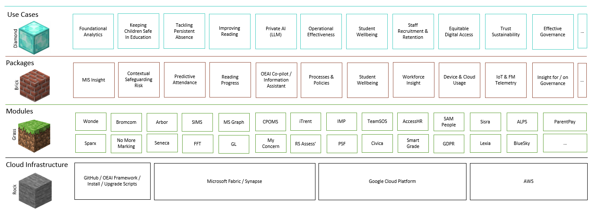
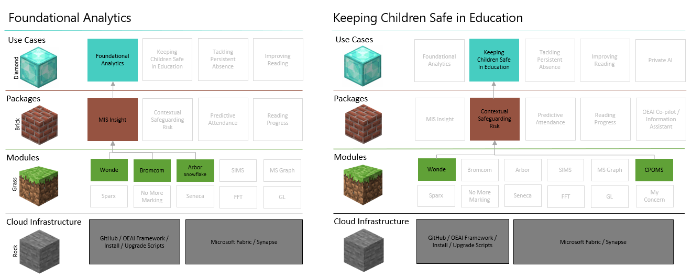

# Welcome to Open Education AI
Open Education AI (OEAI), a not-for-profit social enterprise, has been founded as Centre of Excellence in Data, Analytics and AI for UK Multi Academy Trusts (MATs).  In doing so, it will act as a change agent to help add capacity and capability to the education sector’s use of data analytics and artificial intelligence (AI) to help improve student outcomes and school performance. Our overarching vision is to foster a world where educational equity and improved life chances are a reality for all young people, regardless of background. 

The key drivers behind this collaborative approach for MATs are:
* There is a challenge around capacity and capability for data, analytics and AI human resource in the sector.  
* Very few MATs can afford a full time Infrastructure Architect, Data Engineer, Data Scientist and Data Analyst – four critical roles in a modern data function.
* There are common products used across MATs, and yet individual MATs are forced to reinvent the wheel building data platforms. This is a particularly inefficient use of resources.
* Few single MATs have sufficient data for reliable training of AI for predictive or prescriptive analytics.  All would benefit from shared live benchmarking data, and ethical sharing of insight.
* Data is frequently siloed.  Collective sector action will clarify the importance to EdTech vendors of easy, secure, access to data for the MATs internal business purposes.
* Technology has evolved recently, to make previously very complex tasks achievable with no code/low code, modern data architectures, and AI, and at a cost that is affordable.

## A Minecraft Metaphor - the building blocks of OEAI
OEAI has its roots in [Microsoft's Open Education Analytics](https://openeducationanalytics.org/).  This collaboration of 150+ schooling systems worldwide defined an approach using 'Education Use Cases', 'Modules', 'Packages' and 'Schema', and followed best practices for modern data architectures.  The OEAI framework mirrors this approach but focusses on the UK K12 and School Group (MAT) context to ensure it meets these specific needs and localisation. 

To simplify our approach, we use a Minecraft metaphor for the building blocks:
* __Rock__, or the foundations, represents the Cloud Infrastructure necessary to achieve your educational objectives.  A core OEAI principle is to build assets that can be deployed in any vendors cloud.
* __Grass__ represents a level data playing field.  Layered on the right foundations these 'Modules' extract data from EdTech systems and process it into a standard schema.
* We use __Brick__ 'Packages' to draw together data from Modules and design and create the structures to produce the outcomes.  This might be through data visualisation and reports, machine learning for predictions, or generative AI.
* __Diamond__ is the real value we derive from this actionable insight, and is where the OEAI framework both starts, and ends.  The 'Education Use Case' is an essential part of the process that defines the 'why'.

The following diagram represents this visually, using a number of Education Use Cases that are currently in production with MATs, and examples of common EdTech products in use as Modules (these are illustrative only, other products are available...):

To illustrate how different Education Use Cases may be built with this approach, lets take an example of two currently in production.  Here we can see that MIS Insight, a Package with standard data visualistion across schools, attendance, exclusions and conduct, can work with Wonde, Bromcom or Arbor Modules, and that the Contextual Safeguarding Risk package requires Wonde and CPOMS Modules. Both are currently run from a Microsoft cloud infrastructure:

## GitHub repository structure
The structure of this GitHub repository follows this process.  

* [education-use-cases](education-use-cases).  This folder contains a template to use for the Education Use Case, as well as each published version when they are produced.
* [packages](packages).  This folder contains the technical assets (such as jupyter notebooks) and documentation related to each published package.
* [modules](modules).  This folder contains the technical assets (such as jupyter notebooks),and documentation related to each published module.
* [cloud-infrastructure](cloud-infrastructure). This folder contains the technical assets (such as installation scripts), and documentation related to the main cloud vendors used by MATs.

The repository has been created in January 2024 and will build over time as participation grows.  The following assets are currently under construction:

* Cloud Infrastructure for Microsoft Fabric. Scripts to automate the creation of Fabric Capacity and related Azure Resources to OEAI framework standards.
* The OEAI Python Reference.  A helper Class containing OEAI standard functions used in Modules and Packages.
* Wonde OEAI Module.  This is ready for publication.
* Bromcom OEAI Module.  Expected publication February, based on Bromcom's API.
* MIS Insight Package.  Jupyter Notebooks and Power BI assets to provide a straightforward Trust Analytics on common MIS data.
* Predictive Attendance Package.  To understand historical attednance patterns and predict future attenedance and attendance risk for intervention.  Led by Dixons Academies Trust.
* Contextual Safeguarding Risk Package.  An ethical predictive risk package underpinned by the conceptual contextual safeguarding model.  Led by Greenwood Academies Trust.
* CPOMS OEAI Module.  Required by the Contextual Safeguarding Risk Package.
* Police Crime Data OEAI Module. Required by the Contextual Safeguarding Risk Package.
* Weather Module. Required by the Predictve Attendance Package.
* Education Use Cases:
    * Foundational Analytics
    * Keeping Children Safe in Education
    * Tackling Persistent Absence
    * Improving Reading (Microsoft Reading Progress)
 
    * https://dbdiagram.io/d/OEAI_Silver-65367222ffbf5169f04381a9
