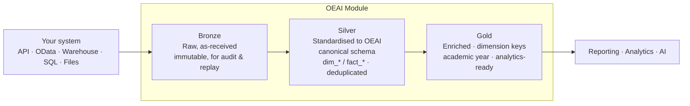

# 1 · Overview — OEAI, modules, and what "good" looks like

This chapter gives you just enough context about how OEAI consumes data to understand *why* the
design choices in the rest of the guide matter. If you only want the engineering requirements,
skip to [Choosing a method](02-choosing-a-method.md).

## What is OEAI?

**Open Education AI (OEAI)** gives schools and Multi‑Academy Trusts (MATs) a single, standardised
view of their own data for analytics and AI, without locking them in. OEAI ingests data from the
systems a trust already uses (MIS, safeguarding, HR, assessment, wellbeing, finance, and more),
standardises it into a common model, and serves it back for reporting, analytics and AI.

A core part of OEAI's mission is **open, interoperable data**: a trust's data should always be
accessible to the trust and to the partners it authorises. Your system providing a clean data
interface is what makes that real.

The **Technical Authority** governs the canonical model that all partner data is standardised into,
and issues this guidance. Where this document states a requirement or a preference, that is the
Technical Authority's position — and it will change it on the evidence if your system shows it
should.

## What is a Data Source Module?

A **Data Source Module** ("module") is a self‑contained pipeline that ingests data from **one
source system** and standardises it into OEAI's analytics model. Your system gets one module.

- **MIS modules** ingest from Management Information Systems (e.g. Wonde, Arbor, Bromcom, SIMS,
  iSAMS). They tend to be broad — pupils, attendance, behaviour, assessment, demographics.
- **Non‑MIS modules** ingest from specialist systems — safeguarding (e.g. CPOMS), HR/payroll
  (e.g. SAMpeople), wellbeing, reading/intervention apps, finance, ticketing, CRM, and so on.

> **Module vs Package.** A *module* ingests one source. A *Package* is a higher‑level capability
> (e.g. Predictive Attendance, Reading Progress) built **on top of** one or more modules. You
> provide data to a module; OEAI composes packages. You do not need to know which packages your
> data will feed.

## How your data flows: Bronze → Silver → Gold

Every module follows the **medallion architecture**. Understanding these three layers explains
the two most important asks in this guide — *atomic records* and *stable identifiers*.

| Layer | What happens | What it needs from you |
|---|---|---|
| **Bronze** | Your data is stored **exactly as received** — no transformation. Kept immutable so we can audit and reprocess history. | A reliable way to pull the data, and (ideally) a change indicator so Bronze loads can be incremental. |
| **Silver** | We map your fields into OEAI's **canonical schema** (`dim_Student`, `fact_Attendance`, `dim_Staff`, …), conform types, deduplicate, and resolve "latest" state. | **Atomic records** and **stable keys** so we can map and deduplicate deterministically. |
| **Gold** | We enrich — join to organisation/student dimensions, derive academic year, clean for reporting — and output analytics‑ready tables. | **Identifiers that resolve to school (URN) and person (UPN / source id)** so dimension joins succeed. |

The single most useful thing you can internalise: **Bronze is "what your system reported", not
"what is analytically true".** We turn the former into the latter — but only if the records are
fine‑grained and carry identity. Pre‑aggregated, identifier‑poor data cannot be un‑aggregated or
re‑keyed downstream.

## Two deployment models (why "stable schema" matters differently)

OEAI is deployed in two shapes. Your interface feeds both — the difference only affects how much
schema stability matters downstream.

| Model | Where it runs | Your data lands in | Schema stability |
|---|---|---|---|
| **OEAI DataLake Builder** | The **trust's own** cloud tenant | The trust's datalake; **Gold tables are a published interface** the trust builds on | High — Gold is a contract; breaking changes ripple into the trust's own reports |
| **Managed service** | Operated on the trust's behalf by an approved delivery partner | The delivery partner's managed platform; schemas are internal implementation detail | Internal — can be refactored |

You do not choose the model — the trust does. Design as if **Gold is a stable contract**, because
under DataLake Builder it is.

## What "good" looks like

A source interface that makes for an excellent module:

- ✅ Exposes **atomic, record‑level** data (the events and entities themselves), not just
  aggregates or dashboards.
- ✅ Puts **resolvable identity on every row** — school URN/establishment number, pupil UPN plus
  your own pupil id, staff id.
- ✅ Supports **incremental pulls** ("changed since *T*") **and** **full reloads** (complete
  history, multiple academic years), and **signals deletes**.
- ✅ Uses **read‑only, least‑privilege, revocable** credentials shared over a secure channel, with
  **per‑school or per‑trust scoping**.
- ✅ Is **documented, predictable, and versioned** — stable schema, clear pagination, explicit
  rate limits, a sandbox to test against.

A source interface that makes a module slow, fragile, or impossible:

- ❌ Only returns **pre‑aggregated** figures (e.g. "attendance % per class per term") with no
  underlying records.
- ❌ Has **no stable identifiers**, or identifiers that don't map to URN/UPN.
- ❌ Offers **no way to detect change** and **no way to get history** — forcing either full
  re‑pulls every run or permanent data loss.
- ❌ Requires **broad, unscoped, shared credentials** or write access.
- ❌ Has an **undocumented or silently‑changing** schema.

The rest of this guide turns each ✅ into concrete, mechanism‑specific design guidance.

## What an engagement looks like

So you know what to expect, an OEAI module build runs roughly:

1. **Intake** — we capture the basics of your system and confirm a data‑export mechanism exists.
2. **Requirements** — you share API docs and (test) credentials; we read them, authenticate, and
   pull sample data before any build starts.
3. **Build** — the commissioned build partner implements Bronze → Silver → Gold; the Technical
   Authority reviews the mapping into the canonical schema.
4. **Development‑partner review** — a first trust reviews the Gold outputs and dashboards.
5. **Pilot** — a short live period with feedback.
6. **GA release** — documentation and publication.

This guide front‑loads steps 1–3: get the *interface* right and the rest is straightforward.

---

**Next:** [2 · Choosing a data‑provision method →](02-choosing-a-method.md)
