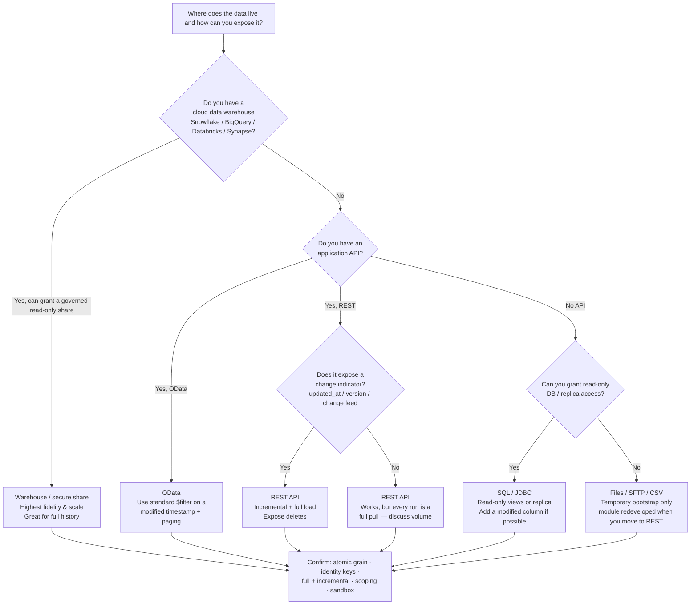

# 2 · Choosing a data‑provision method (the design process)

There is no single "best" way to provide data to OEAI. The right mechanism depends on **how your
system already stores and exposes data**, not on engineering fashion. This chapter is the design
process: a structured way to pick the method that is most suitable for *your* stack, and to know
what "done well" means for it.

> **Principle.** Match the mechanism to the source. We deliberately support several ingestion
> methods so each source can be handled defensively, while everything downstream stays
> consistent. *Ingestion variability is absorbed early, not propagated downstream.*

> [!TIP]
> **Default to REST.** Unless you already have a warehouse or an OData layer that's a natural fit,
> we encourage a **[REST API](method-playbooks/rest-api.md)** from the start. It's straightforward
> to stand up — we hand your developers a ready‑to‑use
> [OpenAPI contract](../templates/oeai-rest-api.openapi.yaml) and a step‑by‑step path — and it's the
> cleanest long‑term feed. **Files/SFTP is a temporary bootstrap only:** choosing it means the
> module will have to be **redeveloped** when you later move to an API, so prefer the API now if you
> possibly can.

## The menu of methods

| Method | Best when… | OEAI ingestion pattern | Playbook |
|---|---|---|---|
| **REST API** | Your product is SaaS with an application API; data changes through the day; you can expose a change indicator | Incremental API ingestion | [REST API](method-playbooks/rest-api.md) |
| **OData** | You already expose OData (common for MIS/reporting layers); you want standard query/paging semantics | Incremental API (OData flavour) | [OData](method-playbooks/odata.md) |
| **Data warehouse / secure share** | You hold data in Snowflake, BigQuery, Databricks, Synapse, Redshift; you can grant a governed read‑only share | Snapshot‑based warehouse ingestion ("scale" method) | [Warehouse & secure share](method-playbooks/data-warehouse-and-secure-share.md) |
| **SQL database (JDBC)** | You can grant read‑only access to a database or replica/reporting views | Snapshot / dual‑path | [SQL database](method-playbooks/sql-database.md) |
| **Files / SFTP / CSV** | *Temporary bootstrap only* — no API yet and you must start now (the module is **redeveloped** when you move to REST) | File ingestion | [Files, SFTP & CSV](method-playbooks/files-sftp-csv.md) |

A REST API, OData, or a warehouse share are all good long‑term feeds — pick by your stack. They're
also not mutually exclusive: a mature integration often combines them (e.g. a **warehouse share for
the historical full load** plus a **REST delta** for daily change). **Files/SFTP is the exception**
— treat it as a stopgap while you stand up an API, not a destination.

## The decision flow

Whatever the flow lands on, the **same five questions** decide whether it will make a good module
— covered in chapters [3](03-what-data-to-provide.md)–[6](06-incremental-and-historical-loads.md):

1. Is the data **atomic** (record‑level), not aggregated?
2. Does every row carry **resolvable identity** (school + person keys)?
3. Can we get **only what changed** *and* **the full history**?
4. Is access **read‑only, scoped, and securely shared**?
5. Is the interface **documented, predictable, and versioned**?

## The selection factors in detail

When you (and we) weigh methods, these are the dimensions that actually matter:

| Factor | What to ask | Pulls you toward… |
|---|---|---|
| **Access surface** | Is data reachable by API, by warehouse, by DB, or only as files? | Use what already exists before building new |
| **Change indicators** | Do records carry a reliable `updated_at`/version, or a change feed? | Change indicators → incremental API/OData; none → warehouse/full snapshot |
| **Historical depth** | Can you serve multiple past academic years, or only "current"? | Need history → warehouse/file backfill; current‑only is a red flag (see [ch.6](06-incremental-and-historical-loads.md)) |
| **Data‑correction behaviour** | Are past records amended/back‑dated? Are records hard‑deleted? | Frequent corrections/deletes → full snapshot or an explicit deletes feed |
| **Scale & volume** | How many schools, pupils, rows? One call for all schools or per‑school? | High volume → warehouse share or chunked/paged API; clarify the **multi‑school pattern** |
| **Latency** | How fresh must data be — daily is the norm; near‑real‑time rarely needed | Daily batch suits almost everything; don't over‑engineer streaming |
| **Security constraints** | Read‑only? Per‑school scoping? IP allow‑listing? Where do creds live? | Drives auth choice — see [ch.5](05-authentication-and-authorisation.md) |
| **Your effort & maintenance** | What can you stand up quickly and keep running? | Start simple, iterate — see below |

## How the methods compare

A rough scorecard (●●● = strong, ● = weak). "Best" depends on your situation — use it to discuss
trade‑offs, not as a ranking.

| | REST API | OData | Warehouse / share | SQL / JDBC | Files / SFTP |
|---|:--:|:--:|:--:|:--:|:--:|
| Fidelity / atomic grain | ●●● | ●●● | ●●● | ●●● | ●●● |
| Native change indicators | ●●● | ●●● | ● | ●● | ● |
| Full‑history backfill | ●● | ●● | ●●● | ●●● | ●●● |
| Scale / large volumes | ●● | ●● | ●●● | ●●● | ●● |
| Speed for you to expose | ●● | ●● | ●● | ●● | ●●● |
| Governance / scoping | ●●● | ●●● | ●●● | ●● | ●● |
| Ongoing maintenance burden | ●● | ●● | ●●● | ●● | ● |

Two patterns we see work especially well:

- **Warehouse for history + API/OData for delta.** The warehouse share gives a clean, complete
  multi‑year backfill once; the API keeps it current cheaply each day. Best of both.
- **SFTP only as a stopgap.** If you genuinely can't expose an API yet, a scheduled CSV export of
  atomic records unblocks a module in days — but treat it as temporary. Moving to a REST API later
  is a module **redevelopment**, so if you can start with the API, do. (Standing one up is
  straightforward — see the [REST playbook](method-playbooks/rest-api.md).)

## Map to OEAI's three ingestion patterns

Internally, every module is built on one of three patterns. Your choice of method maps to one of
them — useful shared vocabulary when we talk:

1. **Incremental API ingestion** — data via API, changes over time, change detection via
   timestamps/versioning. Bronze is append‑heavy; we deduplicate in Silver. *(REST, OData.)*
2. **Snapshot‑based warehouse ingestion** — full, stable tables from a warehouse/reporting DB;
   change detected by comparison, not events; history usually complete. *(Warehouse share, SQL.)*
3. **Configurable dual‑path ingestion** — more than one mechanism is possible and one is chosen
   per deployment (e.g. OData *or* SQL). Bronze supports both; Silver reconciles; Gold is
   invariant. *(Offer this if you can support two routes.)*

## Anti‑patterns (these block or cripple a module)

- **Aggregates only.** "Give us the dashboard numbers" — we can't rebuild pupil‑level analytics
  from class/term summaries. Provide the underlying records.
- **No identifiers, or unmappable ones.** Rows we can't tie to a URN and a UPN/source id can't be
  joined to the rest of the trust's data.
- **No delta and no history.** If every run must re‑pull everything *and* you only keep "current",
  we get high cost and permanent gaps. Provide at least one of: a change indicator, or a full
  historical backfill.
- **Hidden deletes.** If records vanish with no tombstone/soft‑delete, downstream data drifts out
  of sync. Expose deletions explicitly.
- **Unstable, undocumented schema.** Silent field renames break the module. Document and version.
- **One giant shared admin credential.** Won't pass governance. Use scoped, read‑only, revocable
  access.

## How OEAI validates the choice ("kick the tyres")

Before we commit to a build, we don't just take docs at face value — we:

1. **Read** your API/interface documentation end to end.
2. **Authenticate** successfully using the credentials/route you provide.
3. **Retrieve real sample data** from at least one entity/endpoint and confirm atomic grain and
   identifiers are present.

You can accelerate this enormously by giving us **sandbox/test access and a couple of sample
payloads** up front. The [Data Provision Questionnaire](../templates/data-provision-questionnaire.md)
captures exactly what we need to do this.

---

**Next:** [3 · What data to provide →](03-what-data-to-provide.md)
