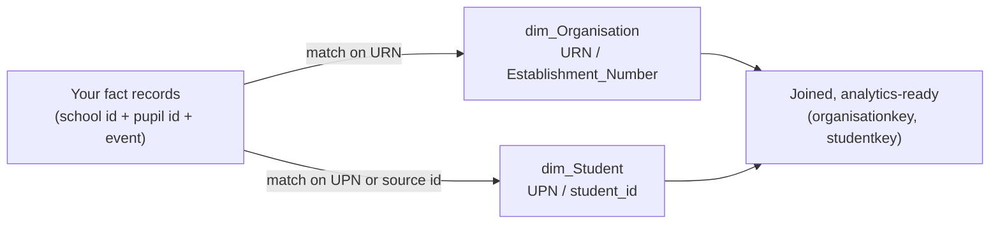

# 4 · Identity & keys — schools, pupils, staff

Identity is where most integrations live or die. OEAI combines your data with the rest of a
trust's data — its MIS, its other systems — into one coherent picture. That only works if every
record you send can be resolved to **which school** and **which person** it concerns, using
identifiers that line up with everyone else's.

> **Principle.** Put **stable, resolvable identity on every row.** A fact OEAI can't tie to a
> school (URN) and a person (UPN / source id) is a fact it can't use.

## The identity spine

OEAI builds an **identity spine** from authoritative sources (usually the MIS) — canonical
`dim_Organisation`, `dim_Student`, and `dim_Staff` dimensions, each with surrogate keys
(`organisationkey`, `studentkey`, `staffkey`). Your facts are joined onto this spine using
**shared natural identifiers**:

So the question for every record you send is simply: **what do we join this on?** The rest of this
chapter answers that for schools, pupils, and staff.

## School / organisation identity

UK schools have several national identifiers. **Provide as many as you reliably hold** — URN is
the priority.

| Identifier | Format | Notes | Priority |
|---|---|---|---|
| **URN** (Unique Reference Number) | 6‑digit | DfE's primary unique school identifier; maps directly to `dim_Organisation.URN` | **Mandatory if at all possible** |
| **DfE Establishment Number** | 4‑digit (unique within an LA) | With LA code, identifies an establishment; `Establishment_Number` | Strongly preferred |
| **LA Code** | 3‑digit | Local Authority code; pairs with establishment number; `LA_Code` | Helpful |
| **UKPRN** | 8‑digit | UK Provider Reference Number (esp. post‑16/colleges); `UKPRN` | Helpful (FE/post‑16) |
| **Your own school id** | yours | Your internal identifier for the school; we keep it as `external_id` | Always send it |

If you operate at trust level and serve multiple schools through one interface, see **multi‑school
scoping** below — every fact still needs its school identifier on the row.

> If you genuinely cannot supply URN, you can supply **school name + postcode** and we will attempt
> a lookup — but match quality is lower and needs manual confirmation. Far better: let the school
> tell you their URN at onboarding and store it.

## Student / pupil identity

This is the most important identity to get right. Provide **both** a national identifier and your
own, plus the school context:

| Identifier | Format | Notes | Priority |
|---|---|---|---|
| **UPN** (Unique Pupil Number) | 13‑character | DfE identifier that follows a pupil **across schools**; maps to `dim_Student.UPN` | **Mandatory if you hold it** |
| **Your source/MIS pupil id** | yours | The pupil's id *in your system* (or the MIS id you received); kept as `student_id` / `external_id` | **Mandatory** |
| **School identifier** | URN / your school id | Which school the pupil belongs to — pupil ids are only unique *within* a school | **Mandatory** |
| Former UPN | 13‑char | If a pupil's UPN changed, the previous one aids matching | Helpful |
| DOB + legal name | — | Fallback matching only, never a primary key | Fallback |

A few rules that matter:

- **Pupil ids are only unique within a school.** OEAI's canonical pupil key is effectively
  *school + pupil id* (`unique_key = school_id + student_id`). Always send the school context with
  the pupil id.
- **UPN is the cross‑school join.** It's how a pupil is recognised across the MIS and your system.
  If you hold it, send it on every pupil‑level row.
- **Measure your UPN coverage and tell us.** We track it explicitly — e.g. on one onboarding,
  "UPN coverage 97.3%, 443 of 16,300 pupils without UPN." Knowing your coverage up front lets us
  plan fallback matching for the gaps.

## Staff identity

Where your system holds staff data (HR, safeguarding, teaching activity), provide:

| Identifier | Notes | Priority |
|---|---|---|
| **Your staff id** | The staff member's id in your system; kept as `staff_id` / `external_id` | **Mandatory** |
| **School identifier** | URN / your school id the record relates to | **Mandatory** |
| **Payroll number** | High‑confidence key for matching the same person across HR/MIS | Strongly preferred (HR) |
| **National Insurance number** | National identifier; strong match key | Preferred where lawful & in scope |
| **TRN** (Teacher Reference Number) | Identifies qualified teachers nationally | Helpful (teaching staff) |
| Legacy/previous‑system id | Aids continuity after a system migration | Helpful |

> **Note.** OEAI's canonical staff dimension today keys on `staff_id` (plus organisation context)
> and carries a `Legacy_System_ID`. Richer staff identifiers — **payroll number, NI number, TRN**
> — are used for cross‑source identity resolution in the HR domain and may be **net‑new** to the
> canonical schema for your module; we'll confirm during requirements (these are reviewed by the
> OEAI Technical Authority). Send what you hold; we'll map it.

## Every fact needs its *own* record id too

Beyond the entity identifiers it references, **each fact record should carry a stable identifier
for the record itself** — your primary key for that row (e.g. `absence_occurrence_id`,
`behaviour_event_id`, `assessment_result_id`). OEAI uses it to:

- **Deduplicate** when incremental loads re‑send amended records.
- **Apply updates** to the right row.
- **Process deletes** — a deletion feed says "record X is gone"; we need X's id to act on it.

Without a stable per‑record id, we have to invent a composite key from the payload, which is
fragile. Give us your real one.

## The non‑negotiables of good identifiers

- **Stable** — an entity's id must not change between loads. If it changes, history breaks.
- **Persistent & non‑reused** — never recycle a retired id for a different entity.
- **Present** — on every row; "identity is implied by which file/endpoint" is not enough once data
  is combined.
- **Consistent across datasets** — the pupil id in your attendance feed must match the pupil id in
  your behaviour feed.

## Multi‑school scoping

If one interface serves many schools, make sure:

- Every record carries its **school identifier** (URN and/or your school id) — don't rely on the
  caller "knowing" which school they asked for.
- We can **filter by school** (per‑school credentials, or a school parameter), so a trust only
  receives the schools in its agreement.
- You can tell us the **multi‑school pattern**: does one call return all schools, or do we loop
  per school? (We design ingestion differently for each — see the
  [Questionnaire](../templates/data-provision-questionnaire.md).)

---

**Next:** [5 · Authentication & authorisation →](05-authentication-and-authorisation.md)
