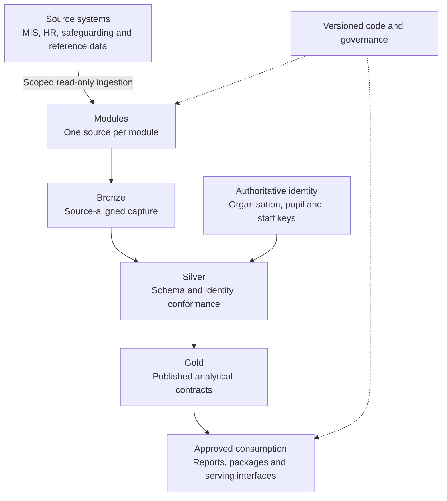
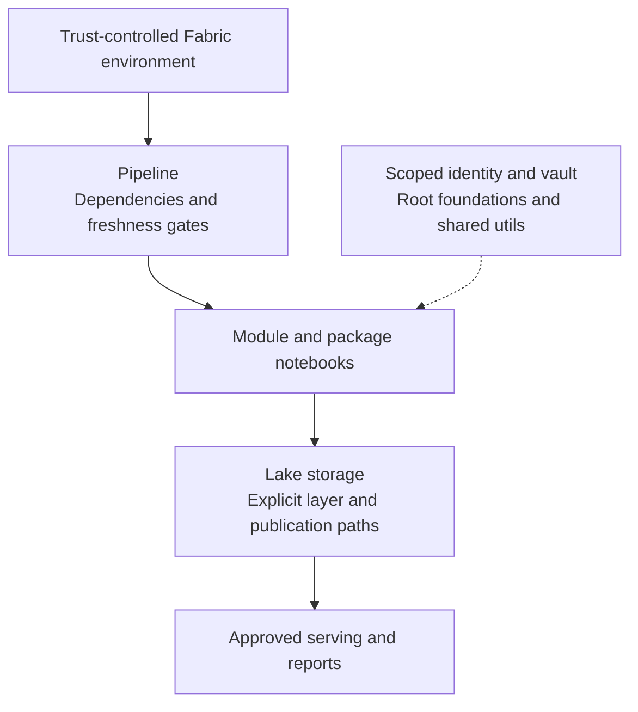

# OEAI System Architecture

> Part of the [OEAI Reference Architecture](README.md). Baseline: **6 September 2026**. See [evidence and references](REFERENCES.md) and [decisions requiring approval](DECISIONS.md).

## 1. Purpose and scope

This document defines the overall shape of the Open Education AI framework: what the system is, the principles it is built on, its logical and deployment architecture, how it is operated and upgraded, and how the platform-neutral architecture maps onto concrete platforms through implementation profiles. The four companion documents define the [module model](02-module-architecture.md), the [data architecture](03-data-architecture.md), the [integration architecture](04-integration-architecture.md), and the [security and accreditation model](05-security-and-accreditation.md).

## 2. What OEAI is

Open Education AI is a **composable data framework for education**: an open, standards-based way for a trust to bring the data scattered across its source systems into a data lake **it owns**, in a **standard schema**, where analytics and AI capabilities built once can serve any school. Trusts choose building blocks across four layers:

| Layer | What it is | Examples |
|---|---|---|
| **Use Cases** | The strategic outcomes the framework serves | Keeping children safe in education; tackling persistent absence; staff recruitment & retention |
| **Packages** | Analytical capabilities composed from module data | Predictive attendance; contextual safeguarding risk; in-year assessment analysis |
| **Modules** | Source-system integrations, one per source, landing data in the standard schema | MIS, HR, finance, assessment, safeguarding, platform-usage, and external-data modules |
| **Infrastructure** | The trust's own cloud data platform, with the OEAI framework deployed onto it from GitHub | A lakehouse platform in the trust's tenancy (Microsoft Fabric in the first reference implementation) |

Two properties make the framework composable. **Modules are vertical**: each one owns the full raw-to-enriched flow for exactly one source system. **Packages are horizontal**: they read the standard schema, not source systems, so packages can be reused where the required schema, identity, temporal and coverage contracts are met. Reuse still requires configuration and local validation; a matching table name alone is insufficient.

## 3. Architecture principles

These principles are the constitution of the framework; every other document elaborates one or more of them.

1. **Trust data sovereignty.** Data lands and stays in an environment the trust owns and controls. The framework is deployed *to* the trust; the trust's data is not pooled centrally.
2. **Modules are independent in execution, integrated in data.** A module must not read another module’s raw data. Shared identity dimensions create explicit read dependencies: schedule their refresh before dependent stages and check freshness. Failures should be isolated where safe, but required-source failure must block dependent publication. Unmatched keys remain unresolved until source coverage or mapping is corrected; another cycle does not guarantee resolution.
3. **Zero tolerance for breaking deployments.** Schema changes are additive; enriched-layer table shapes are stable because reporting depends on them; shared-library changes are backwards compatible. Breaking changes are planned migrations, never side effects.
4. **Layered data flow.** Raw → standardised → enriched, with a defined contract at each boundary (the [Data Architecture](03-data-architecture.md)).
5. **A domain model informed by standards, not constrained by them.** Each data domain's schema is designed from the analytical questions the sector needs answered, cross-referenced against national and international standards (DfE CBDS, census specifications, Ed-Fi, SIF), rather than mirroring whichever source system arrived first.
6. **Composability.** Each package declares required and optional inputs. A required input failure stops the affected build; an optional input may use a documented fallback with visible coverage and freshness. High-risk packages may prohibit fallback entirely.
7. **Quality over speed.** Validation must test the claimed behaviour and disclose its limits. Deterministic calculations require independently checked examples; predictive outputs require held-out evaluation and group-level error analysis. Passing synthetic checks is not proof of operational accuracy. Every module carries validation as a first-class asset.
8. **Platform-neutral architecture, platform-specific profiles.** The architecture mandates the module/package model, the layered flow, the standard schema, and the security posture. It does not mandate an engine. Each platform binding is an implementation profile (§7).

## 4. Logical architecture

*Figure 1 — Logical architecture: vendor sources feed per-source modules; the layered lake conforms everything to the standard schema; packages and reporting consume the enriched layer; the whole estate is governed through the OEAI repositories and the Technical Authority.*

Reading the diagram left to right and top to bottom:

* **Sources** remain the vendors' systems; OEAI takes read-only, scoped access under the [integration contract](04-integration-architecture.md).
* **Modules** are the only components that touch sources. Each lands data raw, standardises it into the domain schema, and enriches it for consumption.
* **The identity spine** — canonical organisation, student, and staff dimensions built from the trust's authoritative source (normally the MIS) — is what every other module joins to, and is the mechanism of "independent in execution, integrated in data".
* **Consumption** is deliberately plural: packaged analytics, curated reports and semantic models, and direct SQL access for the trust's own analysts. The enriched layer is a **consumer interface** — a stable contract the trust can safely build on.
* **Governance** sits outside any single deployment: the standards, schema, and released code live in the OEAI repositories under Technical Authority oversight, and every deployment consumes versioned releases from them.

## 5. Deployment architecture — the trust-tenancy pattern

The reference deployment pattern is the **OEAI Datalake Builder (DLB)**: the framework deployed into the **trust's own cloud tenancy**. Infrastructure is customer-owned; code is OEAI-supplied; data remains in the customer tenant. (The same architecture can equally be operated *for* a trust by an accredited partner; nothing in the pattern changes except who holds the operator role — see [Security & Accreditation §7](05-security-and-accreditation.md).)

In the first reference implementation (`fabric-spark`, on Microsoft Fabric), a deployment provisions one workspace per trust:

*Figure 2 — Deployment anatomy of a single trust deployment (fabric-spark reference implementation).*

**What a deployment includes** (OEAI-supplied, versioned): the module notebooks (configuration, raw, standardised, enriched layers), shared utility and logging libraries, reference data assets, the orchestration pipeline, and reporting semantic models and reports. Initial deployment establishes the canonical folder structure, base reference data, the deployed modules, pipeline orchestration, and reporting connectivity.

**What a deployment excludes** (trust-procured prerequisites): cloud capacity (capacity sized and tested for the intended concurrency, volume and refresh window), the workspace, an Azure Key Vault, a supported workload identity and any licences required by the selected execution path, and the source-system credentials themselves — which are only ever exchanged over an encrypted channel or expiring secure link, never plain email.

**Orchestration** is deliberately simple: one scheduled daily pipeline per deployment, structured as one row per module — raw → standardised → enriched in sequence — with dependency and freshness gates before any final semantic-model refresh. Model training and scoring are separate package activities, sequenced after their required inputs and approvals. Adding a module to a deployment means adding its notebooks, adding one pipeline row, wiring its enriched outputs into the refresh step, and extending the lakehouse schema. Run behaviour is parameterised (e.g. routine refresh vs full historical rebase) rather than forked into variant pipelines.

**Multi-source and multi-school by default.** A single deployment runs any number of modules side by side — including two MIS modules during a migration between MIS vendors — because modules are independent in execution. Where a module supports it, schools are processed with bounded parallelism and isolated failure handling. Its README must state the behaviour. A failed school must remain visibly stale or unavailable, and consumers must not mistake a partial refresh for a complete run. Simultaneous MIS feeds require an explicit authoritative-source and identity reconciliation plan.

## 6. Operations: observability, upgrades, environments

**Observability.** Every module logs through the shared structured-logging framework: hierarchical block tracking (start/end/checkpoint) with standard context on every event — deployment identifier, platform, module, notebook, run id, pipeline id. Ingestion runs are logged per school, per entity, per run, giving each trust an audit and reconciliation trail. Logs should contain counts and operational identifiers, not pupil records or source payloads. If a log or error includes personal data, it inherits **Restricted** handling (see [Data Architecture §8](03-data-architecture.md)).

**Upgrades.** Deployed code is versioned; every notebook carries CI-stamped build metadata (filename, build version, build timestamp) so any deployment can state exactly what it is running. Three upgrade types are distinguished, because they carry different obligations:

| Upgrade type | Meaning | Obligations |
|---|---|---|
| **Implementation** | Performance or defect fix; output meaning unchanged | Deploy in a defined window; validate before/after |
| **Canonical** | The *meaning* of outputs changes (definitions, derivations) | Explicit, documented, communicated ahead of time; may require historical reprocessing, which is always scoped and agreed — never automatic |
| **Platform compatibility** | Tracking platform/runtime changes | Deploy and validate; no output change expected |

Controlled-upgrade rules: versioned code only — deployed notebooks are never edited in place; defined deployment windows; validation before and after; rollback capability; non-production first where the trust runs multiple environments. The responsibility split is explicit: OEAI maintains and versions the code, assesses impact, communicates, and supports deployment and validation; the trust approves timing, maintains capacity, and validates business outcomes.

**Environments.** The baseline trust deployment uses a production workspace. Use a separate controlled validation environment with synthetic data for development and release testing; a production workspace is not a development sandbox. Any real-data validation requires approved purpose, access and retention. The deployment record must specify isolation, promotion, rollback, capacity and named owners; a standard multi-environment topology remains a design item in [DECISIONS.md](DECISIONS.md).

## 7. Reference architecture and implementation profiles

The layered flow is conceptual, not tool-specific. What this architecture fixes is platform-neutral: the module/package model, the layered data flow and its contracts, the standard schema, the integration contract, and the security posture. Each platform binding is documented as an **implementation profile** — the written requirements of one **reference implementation** of this architecture on one platform:

| Profile | Platform | Status |
|---|---|---|
| `fabric-spark` | Microsoft Fabric; Spark/PySpark notebooks; Delta + Parquet | **Active** — first reference implementation |
| `gcp-native` | Google Cloud (shape to be defined — e.g. BigQuery/dbt/Python) | Reserved — defined when the Google-native work starts |
| `custom` | Anything else | Described per-asset in its README |

OEAI's stated direction is **hyperscaler-agnostic and EdTech-agnostic**: most deployments today are Microsoft-based, and portability is a tracked architectural concern rather than an afterthought. The profile mechanism is how new platforms join: a new profile arrives by pull request plus an architecture decision record, and changes nothing for existing profiles. Modules declare their profile in their README; reviewers hold a contribution to the universal standards plus its declared profile, nothing else.

This is also the containment boundary for platform churn: when a platform changes underneath us, the blast radius is one profile, not the architecture.

## 8. Delivery topology — from repository to deployment

The estate flows through a three-stage path, defined fully in the [Module Architecture](02-module-architecture.md):

1. **Contributor environments** — anyone builds anywhere (own GitHub/GitLab/DevOps or directly in the OEAI repositories); CI/CD toolchains are contributor-selected. What is fixed is the quality bar at the point of contribution.
2. **OEAI-Private** — the confidential repository holding pre-GA, pilot, and OEAI-owned assets: the community reference copy of every asset, held to public-grade hygiene.
3. **The public OEAI repository** — GA assets only, Apache 2.0, free to the sector.

Deployments must pin a reviewed commit or release and retain a deployment manifest covering code, runtime, configuration and model artefacts. Notebook build stamps help identify files but do not, by themselves, prove their source commit or approval. GA promotion is a governed release (Stage 7 of the module lifecycle) with a mandatory security check and Technical Authority approval — never an ad-hoc copy.

## 9. Governance

**The Technical Authority (TA)** is the architecture's governing body. Its remit:

* **OEAI Standards** — owning the universal standards and implementation profiles;
* **Schema governance** — the standard schema and its evolution rules (additive-only, versioned, documented; alignment to DfE CBDS, census specifications, Ed-Fi, and SIF), including approval of new enriched-layer tables and identifier patterns;
* **GA sign-off** — approving modules for public release, with security, penetration-testing, and documentation criteria;
* **Vendor neutrality** — scored, criteria-based decisions where vendor interests could collide, under a declared conflicts-of-interest protocol;
* **Contribution governance** — defining the contribution, review, and maintenance processes as the contributor community grows.

The TA's composition principle: trust data and engineering leads, education-sector technologists, cyber-security expertise, and EdTech vendor representation, under signed codes of practice with standing declarations of interest — so the standards are governed by the sector they serve, not by any single supplier.

**Known roadmap items for this architecture** (tracked openly rather than papered over): a standard multi-environment topology and capacity-sizing guidance; formalised type standards across all domains; completed domain schemas beyond MIS and HR; a consolidated in-deployment identity/access architecture (workspace RBAC and row-level security guidance); and the second (Google-native) implementation profile.

## 10. Qualities the architecture optimises for

| Quality | How the architecture delivers it |
|---|---|
| **Sovereignty** | Trust-tenancy deployment; data never pooled centrally; the trust can revoke everything |
| **Repeatability** | Versioned releases, stamped builds, one orchestration pattern, deterministic pipelines |
| **Composability** | Standard schema + explicit dependencies + documented package fallbacks |
| **Portability** | Platform-neutral architecture with per-platform profiles |
| **Auditability** | Governed raw snapshots or change history, per-run logs, deployment manifests and schema documentation |
| **Openness** | Apache 2.0 at GA; standards and schema in the open; sector governance through the TA |
| **Safety** | Read-only scoped ingestion; least-privilege identity; public-grade hygiene everywhere ([Security & Accreditation](05-security-and-accreditation.md)) |

## 11. Operational acceptance

Before go-live, record the selected implementation profile, source and output contracts, source credentials and authorisation, school scope, refresh windows, workload identity, runtime versions, table publication mechanism, model promotion process, access matrix, retention schedule, recovery objectives and support owner. Test the complete consumption route, not only the notebooks. Required checks include source failure, stale data, duplicate keys, missing categories, schema drift, permission denial and recovery after interrupted publication.

The F1 handover extends the repository baseline with CPOMS Insight and five packages. Their exact contracts and synthetic validation are documented in [F1 Operations](https://github.com/Open-Education-AI/OEAI-Private/blob/main/docs/f1/OPERATIONS.md) and the [validation record](https://github.com/Open-Education-AI/OEAI-Private/blob/main/docs/f1/VALIDATION.md). Their local handover status must not be presented as proof they are already merged, deployed or approved in a trust.

> [!WARNING]
> **Contextual Safeguarding is pilot research software and is disabled by default. Under no circumstances may it be used in live operation without explicit ethics approval, expert guidance on configuration, training for every user and strict information governance.** Its category codebook and model approval are mandatory, not optional setup. See [safeguarding governance](https://github.com/Open-Education-AI/OEAI-Private/blob/main/packages/contextual_safeguarding/GOVERNANCE.md) and [Matthew Woodruff’s thesis](https://github.com/Open-Education-AI/OEAI-Private/blob/main/packages/contextual_safeguarding/REFERENCES.md) for work progressed beyond the pilot.

Recovery must match the deployed writer. The F1 recoverable Parquet writers retain a previous table and an exclusive lock during publication; they are not a multi-table transaction and readers can encounter a rename gap. Stop dependent refreshes, reconcile all affected outputs and follow the package runbook before resuming. Do not apply that recovery claim to every older module without testing its implementation.
