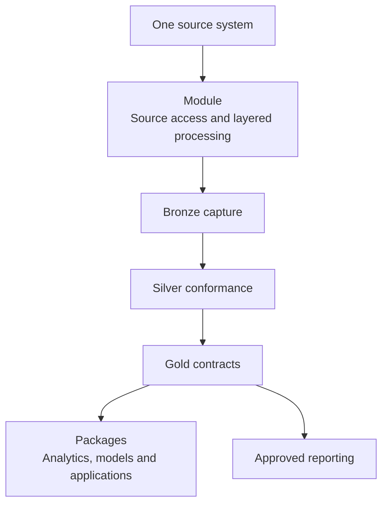
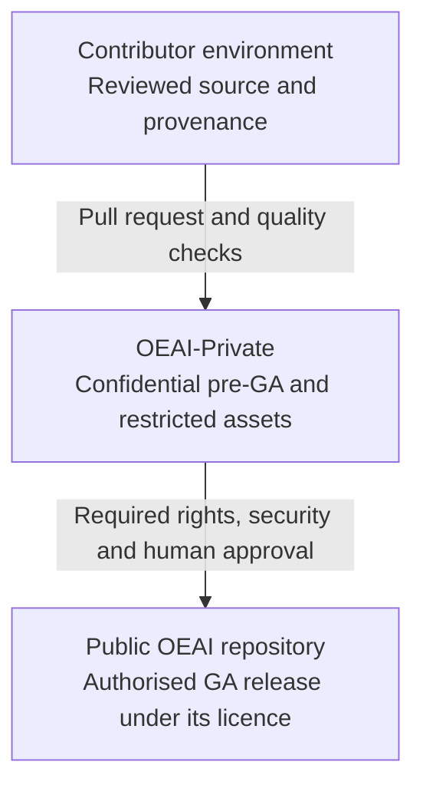
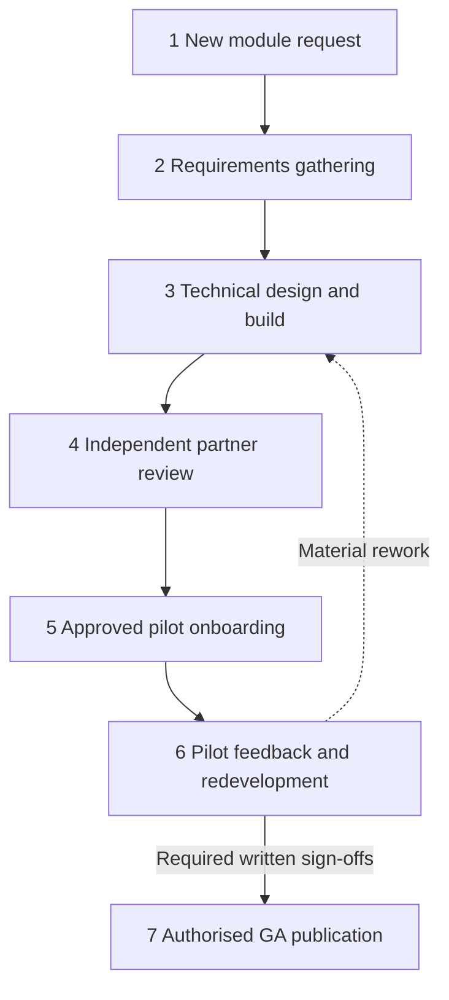

# OEAI Module Architecture

> Part of the [OEAI Reference Architecture](README.md). Baseline: **6 September 2026**. See [evidence and references](REFERENCES.md) and [decisions requiring approval](DECISIONS.md).

## 1. Purpose and scope

This document defines the **unit of contribution** in the Open Education AI framework: what a module is, what a package is, the standards every asset must meet, how assets are named, versioned, reviewed, and released, the licensing model that takes an asset from private development to public Apache 2.0 release, and the contribution model that lets anyone in the community build OEAI assets in the environment of their choice.

It is platform-neutral. Where a concrete platform binding is needed, it is expressed through an **implementation profile** (see [System Architecture §7](01-system-architecture.md)); the `fabric-spark` profile — Microsoft Fabric with Spark/PySpark notebooks — is used throughout as the worked example because it is the first reference implementation of this architecture.

## 2. Modules and packages

The OEAI asset model has exactly two first-class asset types:

* A **module** is a set of assets for moving a **single data source** into a data lake and preparing it for exploration, visualisation, or advanced analytics and AI. A module owns the full raw-to-standardised-to-enriched processing flow for one source system — and nothing else. It does not own reporting, visualisation, or canonical domain rules; those belong to the layer contracts defined in the [Data Architecture](03-data-architecture.md).
* A **package** is a set of technical assets that work with **one or more data sources (exposed as OEAI modules)** to support an Education Use Case — data visualisation, machine learning predictions, generative AI outputs, applications, or anything else that turns module data into actionable insight.

The relationship is strictly layered: **modules feed the lake; packages consume it.** The preferred design puts source-system ingestion in a module. Packages normally consume conformed outputs; any package-specific reference acquisition or direct external input must be declared with its access, caching, privacy and reproducibility contract, and reviewed as an exception. The F1 packages have reference-data dependencies, so this architecture does not claim that every current package is source-independent. This is what makes the ecosystem composable: because every module lands data in the standard schema (see [Data Architecture §4](03-data-architecture.md)), packages are portable across trusts regardless of which source systems those trusts run. For an EdTech vendor the same rule reads: *you provide data to a module; OEAI composes packages.*

*Figure 1 — Modules move single sources into the lake; packages compose module outputs into insight.*

## 3. Universal standards — what every asset must meet

The OEAI standards are split into two layers so the architecture can serve more than one platform without forcing every contribution into the same shape. The **universal standards** are mandatory for every asset regardless of platform:

1. **Complete README** from the standard template, declaring: asset type (module/package), implementation profile, status, source system, dependencies, review tier, data scope (entities and load patterns), outputs with schema documentation links, prerequisites (secret *names* only — never values), configuration (placeholders only), known limitations, and how to validate outputs.
2. **CHANGELOG** from the standard template, following the *Keep a Changelog* convention: `Added` / `Changed` / `Removed` / `Fixed` sections per release, breaking changes flagged explicitly as **BREAKING**, `0.x` versions for work in progress.
3. **Provenance** for externally-built assets: use an approved source reference or controlled handover hash without exposing private source URLs (§7). This traceability recommendation supplements the current contribution checklist.
4. **Security and privacy hygiene**: no credentials, no customer, trust, or school names, no personal data (synthetic samples only), no internal infrastructure details or URLs — see [Security & Accreditation §5](05-security-and-accreditation.md).
5. **Configuration separated from code**, documented with placeholders. All environment-specific values are externalised; nothing deploy-specific is hard-coded.
6. **A documented means of validating outputs** — every asset ships with a way to demonstrate its outputs are correct.
7. **Schema documentation (DBML)** for every tabular data output, kept current in the same pull request as the change it documents.
8. **Standard folder naming** (§5 below) and **tiered review** (§8 below).
9. **Repository hygiene**: no binary archives, no files over 5 MB, no real data.

Everything else — file types, layer expression, logging conventions, platform prohibitions — belongs to the declared implementation profile. Reviewers assess a contribution against the universal standards **plus its declared profile, and nothing else**: a dbt project is never held to notebook rules.

## 4. Module anatomy — the `fabric-spark` reference implementation

Under the `fabric-spark` profile, the documented target for each module is **five notebooks**, named `oeai_mod_{module}_{layer}`:

| Notebook | Layer | Purpose |
|---|---|---|
| `oeai_mod_{module}_env_var` | Configuration | Environment variables and configuration — **all** config lives here: secret names (resolved from the vault at runtime), storage paths, and deployment parameters |
| `oeai_mod_{module}_bronze` | Raw | Extraction from the source system, landed exactly as received |
| `oeai_mod_{module}_silver` | Standardised | Column mapping, type conformance, deduplication, merge into the standard schema |
| `oeai_mod_{module}_gold` | Enriched | Dimension joins, derived attributes (e.g. academic year), analytics-ready output |
| `oeai_mod_{module}_validate` | Validation | Automated checks on the module's outputs (row counts, key collisions, schema stability) |

The current estate includes four-notebook modules and shared validation utilities. Five notebooks are a profile requirement, not a description of every deployed module. A contribution must document how its validation is supplied and record any approved profile exception; do not add an empty validation notebook just to satisfy a count.

Package notebooks are named `oeai_pkg_{package}_{purpose}`. A genuinely missing layer is permitted only with an explanation in the asset's README and pull request — for example, a package with no raw layer of its own.

Profile-level code requirements (defined in full in the profile document) include: structured logging through the shared OEAI logging framework rather than `print()`; CI-injected build-version headers in every notebook; docstrings on all functions; per-school failure handling in the raw layer, with publication blocked where a required input or completeness contract fails; explicit schemas and standard merge-with-retry in the standardised layer; and documented Parquet outputs and an explicit serving step where a Fabric SQL endpoint is required. Notebook outputs and execution counts are stripped before commit, enforced by CI.

Other profiles express the same architecture differently — for instance, a future Google-native profile may express the layered flow as staging → marts dbt models rather than notebooks. What must survive translation to any profile is the **module contract**: one source per module, layered flow, standard schema outputs, externalised configuration, validation, and documentation.

## 5. Naming conventions

| Asset | Convention | Examples |
|---|---|---|
| Module folders | lowercase `snake_case`, one folder per source system | `modules/wonde/` |
| Package folders | lowercase `snake_case`, as required by current CONTRIBUTING.md | `packages/predictive_attendance/`, `packages/mis_trends/` |
| Module notebooks (`fabric-spark`) | `oeai_mod_{module}_{layer}` | `oeai_mod_isams_bronze` |
| Package notebooks (`fabric-spark`) | `oeai_pkg_{package}_{purpose}` | `oeai_pkg_mis_trends_report` |
| Schema files | `schema_{module}.dbml` per asset, plus the canonical `schema_silver.dbml` / `schema_gold.dbml` | `docs/schema/schema_isams.dbml` |
| Branches | `feature/{slug}`, `fix/{slug}`, `docs/{slug}` | `feature/wonde-attendance` |
| Commits | Conventional prefixes: `feat` / `fix` / `refactor` / `docs` / `chore` / `test` | `feat: add attendance entity to wonde silver` |

Successive major revisions of a module may coexist during transition as `{module}/` and `{module}_v2/`, allowing deployments to migrate on their own schedule before the superseded version is retired.

## 6. Repository topology and the licensing model

OEAI assets live in a two-repository topology on the OEAI GitHub organisation, with contributor environments feeding it:

*Figure 2 — The promotion path: contributor environment → OEAI-Private → public OEAI repository.*

The repositories share the `modules/`, `packages/` and `docs/` layout. Preserve the accepted lowercase naming convention and reconcile legacy names during a reviewed migration. Core `oeai_py` and `oeai_logger` notebooks remain at repository root; other shared notebooks live in `utils/` under ADR-0009. Deployment tooling must ensure unique notebook names and correct `%run` resolution.

The repository README treats OEAI-Private as confidential and grants no licence merely through access. The public OEAI repository carries Apache 2.0. Record the actual licence and provenance of each asset; existing third-party and open-source rights do not disappear when a copy is placed in a private repository. Public release requires confirmation that the contributor has the necessary rights and that notices and dependencies are compatible with the proposed licence.

ADR-0006 remains **Proposed** in the inspected repository. Community use terms and contributor rights need explicit resolution by the accountable owners; this document neither grants a new licence nor claims those terms are settled. Repository visibility, maturity status and permission to operate are separate questions.

Even though OEAI-Private is private, **everything in it is held to public-release hygiene standards** — no credentials, no customer names, no personal data, no internal URLs. Private assets may remain restricted and need not become GA, and repository visibility can change in one click; public-grade hygiene turns the pre-publication security check into a confirmation rather than a cleanup.

## 7. The contribution model — build where you choose

OEAI does not mandate a development environment or CI/CD toolchain. Contributors build wherever suits them — their own GitHub, GitLab, Azure DevOps, or directly in the OEAI repositories. What is fixed is the **quality bar at the point of contribution**:

1. **Everything lands via pull request** — no direct commits to `main`, squash-merged, in either repository.
2. Every contribution meets the **universal standards** (§3) plus its **declared implementation profile** (§4).
3. Externally-built assets should record **provenance** in an approved form: source repository and commit where publishable, or a controlled source record plus handover hash where the origin is private. Do not disclose internal repository URLs to satisfy provenance. Current contribution rules do not make the earlier blanket source-URL requirement universal. The copy in the OEAI repository is the **community reference copy** of the asset; provenance makes drift between it and the contributor's home copy detectable.
4. **Continuous integration gates every pull request**: secret scanning, notebook-output checks, and file-policy checks (no archives, no oversized files) run automatically. CI is a safety net, not a substitute for the human review checklist.
5. **AI assists, humans decide.** AI tooling may be used for authoring, migration, advisory review pre-passes, and contextual security sweeps — and significant AI assistance is declared in the pull request — but AI never approves or merges, never counts towards a review tier, and never authors the data-ethics note required for Tier 2 assets.

## 8. The review model — tiered by risk

Review effort is proportionate to the potential impact of the asset:

| Tier | Applies to | Requirement |
|---|---|---|
| **Tier 1** | Standard data movement, documentation, and tooling | One approving review |
| **Tier 2** | Anything **predictive, ML-based, or safeguarding-related** | Two approving reviews including a code owner, **plus a written, human-authored data-ethics note** |

The Tier 2 data-ethics note states what is predicted, about whom, and how the outputs could be misused. It is human-authored and owned. It is a repository review artefact, **not ethics approval, a DPIA or permission to operate**. Contextual Safeguarding additionally requires explicit ethics approval, expert configuration sign-off, all-user training, strict information governance and model-use approval before scoring. [Mandatory safeguarding governance](https://github.com/Open-Education-AI/OEAI-Private/blob/main/packages/contextual_safeguarding/GOVERNANCE.md) defines the blocking checks.

Schema governance sits above code review: any change to the shared reporting surface — a new enriched-layer table, new columns on an existing one, a change to a field's meaning, a new domain, or a new identifier pattern — requires **Technical Authority** approval or notification as defined in the [Data Architecture §7](03-data-architecture.md). Raw-layer development may proceed while a schema question is open; standardised-layer changes wait for the answer.

## 9. The module lifecycle — intake to GA

Every module moves through the seven-stage **Module Build Process**. The stages, their indicative durations, and their gates:

*Figure 3 — The seven-stage module lifecycle. No stage is skipped; every gate is a written sign-off.*

| Stage | Indicative duration | Gate to exit |
|---|---|---|
| 1 · New Module Request | ~1 week | Request assessed and accepted onto the roadmap |
| 2 · Requirements Gathering | ~2 weeks | Data scope, entities, and access method agreed in writing |
| 3 · Technical Design & Build | 4–8 weeks | Asset meets universal standards + profile; validation passing |
| 4 · Development Partner Review | ~2 weeks | Independent technical review passed |
| 5 · Pilot Recruitment & Onboarding | ~3 weeks | Approved pilot scope, trained users and authorised environment established; a live pilot starts only after required approvals |
| 6 · Pilot Feedback & Redevelopment | ~2 weeks | **Written sign-off from all pilot participants** |
| 7 · GA Release & Publication | ~1 week | Security check passed; TA approval; published to the public repository |

Process principles that hold at every stage:

* **Written sign-off is mandatory** — never verbal agreement, never silence-as-consent.
* **Pilot validation is governed** — operational evidence is required for GA under the lifecycle, but the process never authorises use of real data by itself. Ethics, information-governance and safeguarding controls apply before any applicable pilot. Synthetic testing remains the default development path.
* **Security before publication** — Stage 7 includes a mandatory pre-publication security check: repository history reviewed for credential leaks; no secrets or environment files; no customer organisation names; no internal addresses or identifiers; no personal data in notebook outputs; no internal tooling URLs or package references.
* **Release documentation ships with the code** — each GA release publishes an Education Use Case description (what problem this solves, for whom) and a short case study drawn from the pilot, alongside the README, CHANGELOG, and schema documentation.
* **v1.0 ships, v1.1 iterates** — minor items found late are backlogged to a post-GA release, not allowed to block publication indefinitely. A 30-day post-release monitoring window follows every GA release.

New public modules are published subject to **Technical Authority approval**, keeping the public estate coherent with the OEAI Standards and the canonical schema.

## 10. Status vocabulary

Assets declare exactly one status in their README at all times:

`In build` → `Pilot` → `Pre-GA` → `GA-candidate` → **GA** (published to the public repository). Assets migrated from earlier estates may additionally carry `In migration` until they meet the universal standards.

## 11. Open items

Two aspects of the licensing model are defined in intent but have open implementation questions, tracked as architecture decisions:

1. **Community-member usage terms** for OEAI-Private contents — the formal agreement governing what community members may do with pre-GA assets they can see but which carry no licence.
2. **Contributor IP position** — the mechanism (contributor licence agreement or equivalent) confirming that contributed fixes and assets can be relicensed Apache 2.0 at GA.

Both are tracked in [DECISIONS.md](DECISIONS.md). They do not prevent technical review of these documents, but unresolved rights must block any use or publication that requires those rights.

## 12. Package and release contracts

Every analytical package must identify required versus optional inputs, table grain and key, scoring/training periods, missing-data behaviour, output interpretation, refresh strategy and consumers. A score must not be labelled a calibrated probability or entitlement unless validated for that meaning. F1 Pupil Premium outputs are conditional funding scenarios and heuristic investigation signals; assessment calculations depend on upstream qualification and entry contracts.

ML packages need an explicit sequence: build temporally appropriate features, train, evaluate, approve the artefact, then score. Save the code/configuration version, feature order, data window, held-out split design and model version. Evaluation must prevent the form of leakage relevant to the claim: disjoint pupils for concurrent safeguarding identification; a later complete cohort for prospective evaluation. Re-running scoring does not constitute retraining or validation.

A release record must distinguish repository CI, synthetic integration, target-workspace acceptance and human approval. Evidence for one is not evidence for all four. Retain the dependency/runtime manifest and provide a rollback path that covers models and data contracts, not only notebook files. Do not allow a mutable “latest” pointer to bypass an asset’s model approval policy.

For Contextual Safeguarding, the pilot codebook must explicitly assign categories to labels, domain features or reasoned exclusions. Empty configuration is blocked; category changes require renewed sign-off and feature rebuilds. The package refers to [Matthew Woodruff’s thesis](https://github.com/Open-Education-AI/OEAI-Private/blob/main/packages/contextual_safeguarding/REFERENCES.md) for subsequent research and must not be represented as implementing all later thesis contributions.
