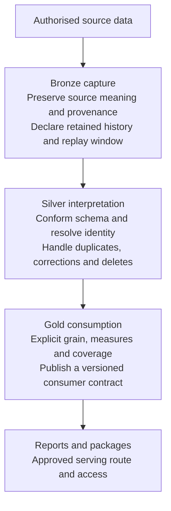
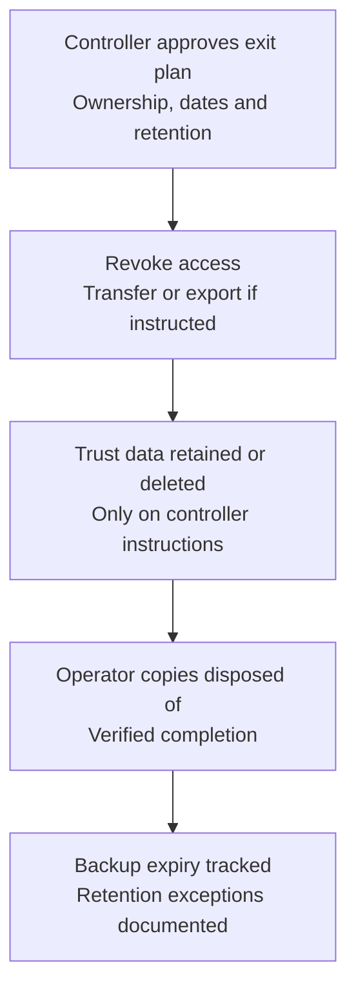

# OEAI Data Architecture

> Part of the [OEAI Reference Architecture](README.md). Baseline: **6 September 2026**. See [evidence and references](REFERENCES.md) and [decisions requiring approval](DECISIONS.md).

## 1. Purpose and scope

This document defines what happens to data inside an OEAI deployment: the layered data flow at the heart of the Datalake Builder pattern and the contract each layer honours; the standard schema and its domains; how identity and keys work; how schemas are governed and evolved; how data is classified; and how long data is retained, including what happens when a trust leaves.

The layered model here is **conceptual, not tool-specific** — it is the same architecture whether expressed as Spark notebooks over Delta tables (the `fabric-spark` reference implementation, used for all concrete examples below) or in any future implementation profile.

## 2. The layered flow — Bronze, Silver, Gold

Every OEAI deployment moves data through three layers, each answering a different question and honouring a different contract:

*Figure 1 — The three layers and their contracts. Each layer can evolve without redefining the others.*

**Bronze is "what your system reported", not "what is analytically true."** It should preserve source meaning and provenance for the agreed fields. A payload may be normalised for storage without changing its meaning. Immutable per-run capture is a design option, not a guarantee of an overwrite path. Declare snapshots, append/merge behaviour, Delta history retention and vacuum policy so the available replay window is known. Never promise recovery of raw history that has already been overwritten or purged.

**Silver is the conceptual backbone of OEAI.** It maps every source into the domain's standard schema, conforms types, resolves identity (students, staff, schools), deduplicates deterministically, handles deletes and corrections explicitly, and aligns records to the academic year. Its guarantees: deterministic outputs, stable identity resolution, reproducible logic.

**Gold is the trust's analytical surface — and a stable contract.** Under the Datalake Builder pattern the trust builds its own reporting on Gold tables, so Gold shapes are public interfaces: changes ripple into trust reports, which is why schema evolution is governed (§7) and why *canonical* upgrades — ones that change the meaning of outputs — are always explicit, communicated events ([System Architecture §6](01-system-architecture.md)).

The concern-to-layer rule of thumb: source corrections are a **Bronze** concern; identity resolution and canonical meaning are **Silver** concerns; KPI aggregation, performance shaping, and reporting logic are **Gold** concerns. Ingestion variability should be absorbed in Bronze and reconciled in Silver. Coverage, freshness and unresolved identity must still remain visible in Gold rather than being hidden by defaults.

## 3. Physical storage standard (`fabric-spark` profile)

| Layer | Format | Write pattern | Notes |
|---|---|---|---|
| Bronze | Delta | Overwrite (full-refresh entities) or append (transactional entities) | History exists only where explicitly retained. Landing may be JSON, CSV or Parquet according to the source; the asset declares the actual contract |
| Silver | Delta | **Merge (upsert) on business key**, preserving surrogate keys | Explicit schemas enforced; merge-with-retry for concurrent writers; schema auto-merge only where governed |
| Gold | Parquet | Overwritten / rebuilt each run | Rebuildable only with retained inputs, code, configuration and any model/reference artefacts; serving route must be explicit |

Two properties matter more than the formats themselves: **Silver merges must preserve surrogate keys** (a record keeps its key for life, however many times the source restates it), and **rebuildability must be demonstrated**. Derived module tables may be reproducible from retained Silver, but package outputs can also require prior features, model binaries, reference data, approved coding and a historical configuration. Model registries, approvals and audit records are not disposable caches.

## 4. Domains and the standard schema

A **domain** is a category of data with a shared Silver schema contract — the contract all modules in that domain conform to, however different their sources look. Current domains: **MIS, HR, Safeguarding, Assessment, Platform/Usage, Operational, Finance, and External** (weather, police, public statistics).

The standard schema is dimensional: `dim_*` dimensions and `fact_*` facts. The MIS domain — the most mature — illustrates the shape:

| | Tables |
|---|---|
| **Dimensions** | `dim_Date`, `dim_Organisation`, `dim_Student`, `dim_StudentExtended`, `dim_Staff`, `dim_Group`, `dim_GroupMembership`, `dim_SENDNeed`, `dim_Address`, `dim_UserDefinedFields`, `dim_Event` |
| **Facts** | `fact_AttendanceSession`, `fact_AttendanceLesson`, `fact_AttendanceSummary`, `fact_Behaviour`, `fact_Achievement`, `fact_Exclusion`, `fact_Attainment`, `fact_StaffAbsence`, `fact_Deletion` |
| **Gold-calculated** | Academic-year student groupings, attendance trend tables with year-to-date, prior-year and two-year comparatives, persistent-absence indicators |

Facts are defined at **atomic grain** — one row per pupil-session-date for session attendance, one row per behaviour event, one row per pupil-assessment-result — because atomic records can always be aggregated up but aggregates can never be broken back down ([Integration Architecture §2](04-integration-architecture.md)).

**The identity spine.** Three dimensions — `dim_Organisation`, `dim_Student`, `dim_Staff` — are the canonical identity tables, built from the trust's authoritative source (normally the MIS). Every other module integrates by joining to them through shared natural identifiers. National identifiers are first-class fields: URN, DfE establishment number, LA code, and UKPRN on organisations; UPN on pupils. This is how a safeguarding module and an HR module land data that immediately lines up with MIS data without either knowing the other exists.

**Provenance requirements.** The following are useful logical fields, not columns guaranteed in every current table. Consult each DBML and runtime schema; current implementations also use `external_id`, `school_id`, `organisationkey`, `_last_updated` and package-specific timestamps:

| Column | Meaning |
|---|---|
| `_source_system` | Which source produced the record |
| `_source_id` | The record's primary key in that source |
| `_oeai_ingested_at` | When OEAI ingested it |
| `unique_key` | Source-derived merge/dedup key where implemented; distinct from the persistent surrogate key (§5) |

## 5. Identity and keys

The key model has three tiers:

1. **Business (natural) keys** identify a record in source terms and drive Silver merges. Pupil identifiers are only unique within a school, so composite keys are the norm: `school_id + student_id` for a pupil, `school_id + staff_id` for a staff member, plus the record's own stable identifier for facts.
2. **Surrogate keys** are persistent dimension/fact identifiers such as `organisationkey`, `studentkey` and `staffkey`. The current MIS code distinguishes these from `unique_key`, which commonly contains a source-derived or composite merge key. Preserve existing surrogates on updates and obtain them through an authoritative join; do not regenerate them during a routine refresh. Key generation varies by asset and must be documented. A different UUID or hashing scheme requires a migration and reconciliation plan, not a silent global replacement.
3. **Cross-domain identity** is resolved through **bridge tables** (e.g. a staff-identity bridge linking MIS and HR views of the same person), never by mutating domain schemas. Where multiple sources legitimately populate one dimension — MIS and HR both describing staff — define source precedence and coexistence explicitly. Do not assume a common metadata column or a shared UPN automatically deduplicates multi-MIS records. Joining ambiguous matches or two authoritative feeds without that plan can double-count pupils.

## 6. Load patterns

**Incremental by default.** Each module maintains a per-school, per-entity **watermark** — the "last successful" marker — requesting only what changed since, and advancing it only on success. A failed run therefore reprocesses rather than skips. A rolling **catch-up window** (re-reading the recent past, e.g. the last fortnight, on every run) absorbs late corrections and back-dated amendments, which are routine in education data.

**Deletes are explicit.** Deletions arrive through a supported feed, soft-delete flag or a **validated complete** snapshot comparison. Absence from an incremental, failed or filtered extract is not a deletion. `fact_Deletion` exists in some MIS contracts; other sources expose different delete fields. Declare and test how each deletion reaches every dependent layer.

**Full loads are chunked and idempotent.** Initial backfill and periodic **rebase** runs execute as date-bounded, resumable chunks. History depth must be justified for each purpose and approved by the controller. Three academic years may be a useful analytical requirement; it is not a retention mandate, and longer pupil/staff history must not be enabled solely because the source can provide it (§9).

**Academic-year alignment** must be explicit in the asset contract: the applicable Silver or Gold stage assigns or preserves each fact’s academic year (England convention: 1 September – 31 August, with per-school calendars supported through the academic-year dimension), enabling like-for-like year-to-date and prior-year comparisons.

## 7. Schema governance and evolution

The standard schema is a core part of the reference architecture — it is what makes modules interchangeable and packages portable — so it changes by governed evolution, not by drift:

1. **Additive only.** New columns are nullable additions. Columns are never removed, renamed, or retyped in place; anything else is a planned, versioned migration.
2. **Domain-wide.** A schema change applies to every module in the domain together; a module that cannot populate a new field carries it as NULL rather than diverging.
3. **Versioned and documented.** Every change carries a version bump and a written rationale, with coordinated updates to downstream semantic models.
4. **Documented as code.** Every module ships DBML schema documentation (canonical Silver/Gold definitions plus per-module files), updated in the same pull request as the change, and publishable to the community schema reference.
5. **Externally cross-referenced.** Domain schemas record their alignment to national and sector standards — DfE CBDS and census specifications first, then Ed-Fi, SIF, and CEDS — with each field marked *aligned*, *diverged (documented)*, *extended*, or *not applicable*.
6. **Technical Authority oversight.** New Gold tables, new columns on existing Gold tables, changed field meanings, new domains, and new identifier patterns all trigger TA approval or notification before Silver work proceeds ([Module Architecture §8](02-module-architecture.md)).

Treat the per-table DBML and conformed schema as the concrete type contract. The current estate contains string, integer and long keys/flags, decimal financial values and string/date/timestamp variants. Preserve leading zeros in natural identifiers, declare time zones and units, and validate casts. Preferred future conventions must not be described as already universal or imposed without compatibility review.

## 8. Data classification

This reference baseline uses four handling levels, which each controller must map to its approved policy. Adoption as a formal organisation-wide policy requires a recorded owner and approval; it is not inferred from this document. Handling classification and the legal categories of personal data are separate assessments.

| Level | Definition | Examples in an OEAI deployment |
|---|---|---|
| **Public** | Published or publishable without harm | The OEAI standard schema documentation; published aggregate statistics |
| **Internal** | Operational data, no personal content | Pipeline execution logs, run metrics, build metadata |
| **Confidential** | Business-sensitive, non-personal | Deployment configurations, commercial documents |
| **Restricted** | Personal data of pupils, staff, and families | **All customer data in Bronze, Silver, and Gold — at every layer** |

The rules that matter most in practice:

1. **All trust data in the lake is Restricted, at every layer.** Gold aggregation does not downgrade classification — a year-to-date attendance measure is still pupil-level data. Only properly anonymised, aggregated statistics leave the Restricted class.
2. **All special-category data is Restricted, but not every sensitive education field is automatically special category.** Ethnicity and health information engage Article 9; SEN or inferred attributes may reveal health or other protected information depending on content and use. FSM, Pupil Premium, care status and EAL need contextual assessment rather than blanket legal labels. Record the relevant lawful basis and additional conditions with the DPO; criminal-offence data has separate requirements. See [ICO guidance](REFERENCES.md).
3. **Restricted handling requirements**: the controller-approved residency boundary (UK is the reference deployment preference); strong encryption at rest and TLS 1.2+ in transit; **per-trust isolation**, with approved storage, workspace and consumption permissions and verified separation; access restricted to the minimum operating team under role-based access control with MFA; documented deletion with customer confirmation ([§9](#9-retention-and-offboarding)).
4. **Classification is inherited downstream.** Anything derived from Restricted data is Restricted until an explicit, documented anonymisation step says otherwise.

The repository-side corollary: because everything in the lake is Restricted, **nothing from the lake ever appears in a repository** — no real data, no notebook outputs, synthetic samples only ([Security & Accreditation §5](05-security-and-accreditation.md)).

## 9. Retention and offboarding

**During the contract.** Source data is refreshed on the deployment's schedule; history is retained to serve trend and year-on-year analysis within the depths at §6, under the trust's own retention policy — the trust is the data controller, and the deployment's retention posture is an instrument of the trust's policy, not a replacement for it. Raw Bronze history is retained for audit and reprocessing within that same policy. Data for pupils and staff who have left the trust remains available for longitudinal analysis within the agreed retention period.

**Retention is purpose-specific.** Agree periods for live tables, raw history, leavers, logs, model artefacts, evaluation manifests, exports, staging/previous versions and backups before use. UK GDPR does not prescribe one universal 30-day export window or 90-day deletion deadline; contractual periods must be stated and consistent with the controller’s needs and duties. See [ICO storage-limitation guidance](REFERENCES.md).

**Offboarding separates access revocation from data disposal.** Removing a partner does not instruct deletion of the trust’s own lake or remove rights already granted in a software licence. The controller decides whether to retain, transfer or delete its data. An external operator returns or deletes its copies on documented instructions, with lawful retention exceptions recorded.

*Figure 2 — Controlled offboarding with explicit ownership and disposal instructions.*

The runbook must identify the accountable owner, dates, verification evidence and dependencies. Include caches, downloaded artefacts, SQL/semantic-model copies, model training splits and recovery copies. Record when backup data becomes inaccessible and when it expires; a restore must reapply deletions. Do not claim completion while an unaccounted copy remains.

## 10. Data quality and validation

The governing requirement is evidence appropriate to each claim. Reconcile deterministic measures and quantify uncertainty in model outputs; neither a successful run nor overall accuracy alone establishes fitness for use.

* **Nulls are information.** Sentinel values (`''`, `'NULL'`, `'None'`, epoch-default dates) are normalised to true nulls in Silver; records are not destructively pre-filtered. Quality is handled *in* the standardised layer, visibly, not upstream, silently.
* **Every module ships validation** covering, as standard: production-column preservation; expected new columns; total column count; frozen column types; row-count preservation across layers; presence of new source rows; unique-key collision detection; Gold–Silver row-count reconciliation; and multi-source consistency.
* **Validation is a release gate.** Modules need passing synthetic and integration validation before controlled pilot acceptance; real-data validation requires its own authorisation, and canonical upgrades re-run validation before and after deployment.
* **Reconciliation is continuous.** Per-school, per-entity, per-run ingestion logs make source-to-lake reconciliation a query, not an investigation.

## 11. Publication and high-risk data contracts

Plain Parquet Gold paths are not automatically queryable through a Fabric lakehouse SQL analytics endpoint. The serving design must publish compatible Delta tables in the supported lakehouse location, use an appropriate supported shortcut, or document another consumer connection. SQL security applies to endpoint access and does not automatically restrict Spark or direct storage reads. See [Microsoft’s endpoint contract](REFERENCES.md); test permissions through every access route.

A table overwrite is not a transaction spanning a package. F1 recoverable writers use a verified staging table, an exclusive lock and a retained previous version. A rename gap remains, and dependent tables can represent different runs after interruption. Consumer refresh must wait for all required publications and reconciliation. Preserve locks for manual recovery when restoration fails; do not automatically take a lock from a potentially active writer.

Contextual Safeguarding requires a complete, explicit local category codebook: label categories, disjoint domain-feature categories and reasoned exclusions. Unknown or uncategorised included incidents stop processing. The feature table carries `Configuration_SHA256`; training/scoring refuse stale provenance or out-of-scope organisations. Categories and model outputs remain Restricted, including audit tables and explanation text.

> [!WARNING]
> Live safeguarding use requires explicit ethics approval, expert configuration guidance, training for every user and strict information governance. No score establishes safety or justifies reducing support. See [mandatory package governance](https://github.com/Open-Education-AI/OEAI-Private/blob/main/packages/contextual_safeguarding/GOVERNANCE.md) and [Matthew Woodruff’s thesis](https://github.com/Open-Education-AI/OEAI-Private/blob/main/packages/contextual_safeguarding/REFERENCES.md) for work beyond the pilot.
