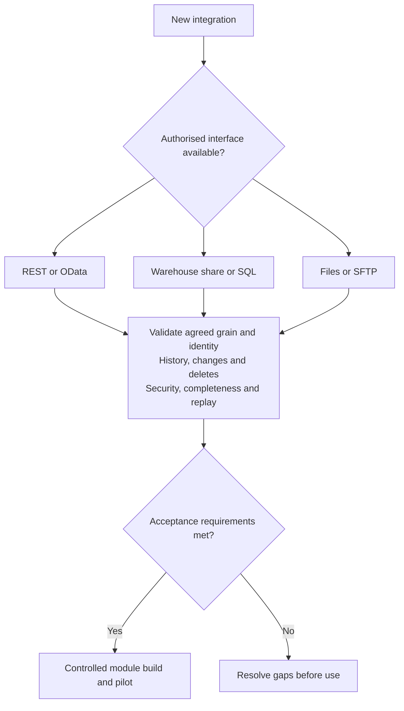
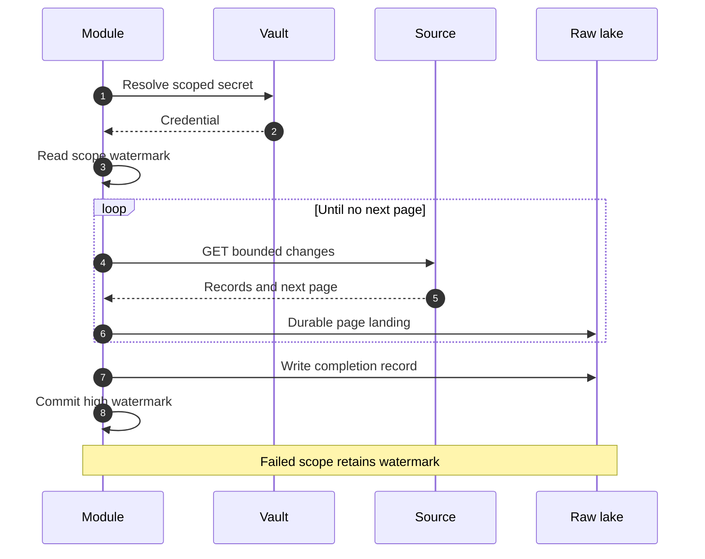

# OEAI Integration Architecture

> Part of the [OEAI Reference Architecture](README.md). Baseline: **6 September 2026**. See [evidence and references](REFERENCES.md) and [decisions requiring approval](DECISIONS.md).

## 1. Purpose and scope

This document defines how data gets **into** the OEAI architecture: the integration methods OEAI supports, how a method is chosen for a given source system, the patterns used to integrate Management Information Systems (MIS) and other EdTech products, and the **Partner Integration Guide** — the engagement model through which an EdTech vendor makes its product OEAI-ready.

In scope: source system → OEAI module ingestion. Out of scope: data flowing **out** of a trust's data lake to third parties (the Open Data Access Layer — a separate workstream with its own governance), and what happens to data after landing (the [Data Architecture](03-data-architecture.md)).

The audience is twofold: **OEAI module builders** choosing and implementing an ingestion method, and **EdTech vendors** deciding what to expose so their product integrates well.

## 2. The integration contract — five questions

Every integration must document five questions before a module is built. For pupil-level use, atomic grain and resolvable identity are blocking requirements. Public aggregate/reference datasets have their own declared grain and geography/time keys; they do not require a pupil identity:

1. **Is the data atomic?** Record-level detail, not aggregates. *We can always sum atomic records up; we can never break an aggregate back down.*
2. **Is identity resolvable on every row?** Every record carries stable identifiers that map to the OEAI identity spine (§6).
3. **Can we get only-what-changed *and* full history?** Both an incremental path for daily operation and a full-load path for backfill and reconciliation.
4. **Is access read-only, scoped, and securely shared?** Least privilege by construction — see [Security & Accreditation](05-security-and-accreditation.md).
5. **Is the interface documented, predictable, and versioned?** Stable schemas, published limits, and a deprecation policy.

For pupil-level analytical claims, aggregates alone or unresolved identity are blocking gaps. A missing delta feed may be addressed by a complete, validated snapshot process. Hidden deletions, unstable schemas and shared administrative credentials require resolution before operational use.

## 3. Ingestion patterns

Three system-level ingestion patterns cover the estate. They are the shared vocabulary between the integration and data architectures — the guiding principle being that **ingestion variability is absorbed early, not propagated downstream**: whatever the transport, the standardised layer reconciles it and the enriched layer is invariant.

| Pattern | How change is detected | Raw-layer behaviour | Typical fit |
|---|---|---|---|
| **Incremental API ingestion** | Timestamps / versioning on each record (REST or OData) | Append-heavy; deduplicated downstream | Modern APIs with reliable `updated_at` semantics |
| **Snapshot-based warehouse ingestion** | Comparison between successive full snapshots of stable tables | Full-table snapshots; history usually complete | Warehouse shares and SQL sources at scale — "the scale method" |
| **Configurable dual-path ingestion** | Either of the above, chosen **per deployment** | Raw layer supports both paths; standardised layer reconciles | Sources exposing multiple surfaces (e.g. OData *or* SQL), where trusts differ in what they can enable |

## 4. Method taxonomy and selection

OEAI supports five integration methods:

| # | Method | Position |
|---|---|---|
| 1 | **REST API** | The recommended default for new integrations |
| 2 | **OData** | A strong API variant — self-describing metadata, standard query semantics |
| 3 | **Data warehouse / secure share** | The scale method: provider-managed shares (e.g. Delta Sharing, Snowflake Secure Data Sharing, BigQuery authorised views, read-only warehouse roles) |
| 4 | **SQL database** | Read-only JDBC access to a replica or reporting views |
| 5 | **Files / SFTP / CSV** | A constrained, reviewed method. The current CPOMS Insight handover ingests file exports. Agree transfer security, completeness, frequency, retention and ownership; use an API migration plan where feasible, but do not claim the current file-based module is already an API integration |

A mature hybrid is explicitly recognised: **a warehouse share for the historical full load plus a REST delta feed for daily change.**

Method selection weighs: the source's available access surfaces; the quality of its change indicators; historical depth (three-plus academic years is desirable; *current-year-only is a red flag*); how the source handles corrections, back-dating, and deletes; scale and multi-school access patterns; latency requirements (daily batch suits almost everything — streaming is not to be over-engineered); the vendor's security constraints; and ongoing maintenance burden.

*Figure 1 — Method selection. Every route converges on the same five confirmations before any module is built.*

Whatever the route, a **"kick the tyres" validation** precedes any build: read the interface documentation end-to-end, authenticate against it, and retrieve representative synthetic sandbox records confirming atomic grain and resolvable identifiers; real records require prior authorisation and approved handling. No module enters Stage 3 (Technical Design & Build) of the [module lifecycle](02-module-architecture.md) on the strength of documentation alone.

## 5. MIS integration patterns

The MIS is the anchor integration for every trust: it is normally the **authoritative source for the identity spine** (organisations, students, staff) that every other module joins to. MIS platforms in the England market expose very different surfaces, and the taxonomy above absorbs all of them:

* **Aggregator API pattern** — a single API fronting many underlying MIS platforms, giving one integration surface across mixed-MIS trusts. One module serves every school behind the aggregator; per-school authorisation is granted school-by-school.
* **Native API pattern** — the MIS vendor's own REST API, integrated per the incremental API pattern.
* **OData feed pattern** — MIS platforms exposing OData endpoints; self-describing metadata accelerates schema discovery, and standard query options provide filtering and paging.
* **Direct SQL pattern** — read-only access to the MIS database, its replica, or vendor-provided reporting views; integrated per the snapshot pattern.
* **Dual-path MIS** — some platforms expose more than one of the above; the module supports both paths and each trust deployment selects one (the configurable dual-path pattern), so the choice reflects what that trust can enable rather than forcing a lowest common denominator.

The private repository contains implemented MIS connectors including Arbor, Bromcom, Wonde and iSAMS. Check each asset’s status, supported access path and current release evidence; presence in a repository is not proof of GA or support for every method. The Partner Integration Guide provides method playbooks; a playbook is a design reference, not a deployed connector. Multi-school mechanics are part of every MIS pattern: schools are enumerated from configuration, pulled with bounded parallelism, scoped by school for authorisation and failure handling (partial failures must remain visible and block affected publication where required), and landed with the school identifier stamped on every record.

Non-MIS EdTech products (safeguarding, assessment, HR/workforce, wellbeing, surveys, helpdesk and estates systems) follow exactly the same taxonomy — there is no separate "small vendor" architecture. The difference is engagement: MIS integrations are typically OEAI-initiated; other EdTech integrations usually arrive through the Partner Integration Guide (§9).

## 6. Identity and keys

Integration stands or falls on identity. The requirements OEAI places on every source:

**School level.** The **URN** (the DfE's 6-digit unique reference number) wherever possible; DfE establishment number, LA code, and UKPRN welcome; the vendor's own school identifier always (it becomes `external_id` in the standard schema). Name-and-postcode matching is a last-resort fallback, not a design.

**Pupil level.** The vendor's pupil identifier **plus school context** is mandatory — pupil identifiers are only unique within a school, so the standard merge key is the composite `school_id + student_id`. The **UPN** (13-character unique pupil number, which follows a pupil between schools) is strongly preferred on every pupil record, and UPN coverage is measured explicitly during onboarding. Name/date-of-birth matching needs a separate approved procedure, measured ambiguity and human resolution. It must not silently assign safeguarding records. CPOMS Insight ships with fuzzy school matching disabled; use stable identifiers or an explicitly reviewed mapping.

**Staff level.** Use the vendor’s staff identifier with school/source context. Select any additional matching identifier only where necessary and authorised; do not collect National Insurance or other sensitive identifiers merely because they might improve a join.

**Record level.** Every fact record carries its own stable identifier — the basis for deduplication, update detection, and delete handling.

Non-negotiable properties for all identifiers: **stable** (never re-keyed on re-import), **persistent and non-reused**, **present on every row**, and **consistent across datasets** from the same vendor.

## 7. Incremental and historical loads

Every integration declares how it provides both full reconstruction and change reconciliation. These may be separate API paths or a validated snapshot-based mechanism:

* **Full load** — complete history (target: three-plus academic years) for initial backfill, periodic reconciliation, and raw-layer replay when downstream logic improves. Full loads are executed as **date-bounded, idempotent, resumable chunks**, never a single monolithic pull.
* **Incremental load** — everything changed since a per-school, per-entity **watermark**: the "last successful" marker advanced only on success, so a failed run reprocesses rather than skips.

Supported change indicators, assessed for the source’s guarantees:

1. An **`updated_at` timestamp that bumps on *every* change** — the classic failure mode is a creation-only timestamp, which silently loses corrections;
2. A **monotonic version / rowversion** column;
3. A **change feed / CDC** surface.

Deletes are never inferred by absence alone in incremental mode: acceptable mechanisms are a soft-delete flag on the record, a deletions feed (tombstones), or full-snapshot comparison.

Two education-sector behaviours are first-class design inputs, not edge cases: **data is routinely amended and back-dated** (attendance corrected days later, assessment results revised), which is why creation-only timestamps disqualify a change indicator; and **academic year rollover** in some systems purges or re-keys data, which is designed around by snapshotting before rollover.

*Figure 2 — The incremental ingestion cycle for one school × entity.*

## 8. Interface quality expectations

What OEAI asks of an API (and, adapted, of every method):

* **Pagination**: cursor/keyset preferred over offset (stable under concurrent change); an explicit next-page token; a stable, deterministic sort (e.g. `updated_at, id`); page sizes in the hundreds to low thousands.
* **Rate limiting**: published limits; `429` responses carrying `Retry-After` (the connector must implement and test bounded retry/backoff); a stated safe concurrency for multi-school parallel pulls; a bulk or all-schools endpoint where per-school limits are tight.
* **Errors**: correct HTTP status codes and machine-readable error bodies with a stable error code and a request identifier for support correlation.
* **Formats**: JSON for APIs; RFC 4180 CSV or Parquet for file exchange; Parquet/Delta for warehouse shares; UTF-8 throughout; ISO 8601 timestamps in UTC.
* **Change management**: additive-first schema evolution; breaking changes behind a version (`/v2/`); a changelog and a stated deprecation policy.
* **A sandbox** with representative, anonymised data, so integration is proven before any live pupil data flows.

Sources can correct records within the same requested window. Idempotency therefore means repeated processing of equivalent source versions does not duplicate or corrupt state, not that the source response is frozen. Capture a high watermark, use inclusive overlap/tie-break handling, complete pagination before advancing state, and test late corrections, rate limits, partial pages, duplicate deliveries and resumable backfill.

## 9. The Partner Integration Guide

The Partner Integration Guide is the productised engagement path for EdTech vendors, available in the private repository at `docs/partner-integration/`. Its artefacts:

1. **The guide itself** — eight chapters walking a vendor from "what OEAI is" through method choice, data scope, identity, authentication, incremental loads, API design quality, and security & governance; plus per-method playbooks for each of the five methods.
2. **The Data Provision Questionnaire** — a structured intake covering the vendor's system, data domains, access method, identity coverage (including URN/UPN coverage percentages), incremental/history/delete semantics, security posture (hosting region, sub-processors, certifications, rotation and revocation), and API design specifics. A completed questionnaire is the entry ticket to Stage 2 (Requirements Gathering) of the module lifecycle.
3. **The readiness checklist** — a one-page self-assessment. Scoring is deliberately blunt: **gaps in identity or atomic grain block; gaps in incremental mechanics or interface polish are workable.**
4. **A reference API contract** — an OpenAPI 3.1 specification a vendor can generate server stubs from in any mainstream stack, for vendors who would rather implement OEAI's shape than design their own.
5. **Canonical entity reference** — the standard entities and fields ([Data Architecture §4](03-data-architecture.md)) expressed vendor-side: what to provide so mapping into the standard schema is mechanical.
6. **Per-vendor guides** — the generic guide specialised for a named product, produced during engagement, with a concrete field mapping.

What the vendor gets in return — OEAI's standing assurances: credentials held in a managed vault, resolved at runtime by name, never committed to code or configuration; per-school credential isolation; secure-channel credential handover (never plain email); rotation without code change; read-only, scoped access only; and ingestion run logs kept per school, per entity, per run for audit and reconciliation.

## 10. Integration lifecycle summary

An integration is not an ad-hoc connection; it is the front end of a governed module build:

| Integration step | Module lifecycle stage |
|---|---|
| Questionnaire returned; method shortlisted | Stage 1 — New Module Request |
| Method confirmed; scope, entities, identity coverage agreed; sandbox access granted | Stage 2 — Requirements Gathering |
| "Kick the tyres" validation passed; module built against the method playbook | Stage 3 — Technical Design & Build |
| Interface quality verified under review; live pilot in 1–2 trusts | Stages 4–6 — Review, Pilot, Feedback |
| Vendor listed against a GA module; per-vendor guide published | Stage 7 — GA Release |

The result is that "integrated with OEAI" always means the same thing: atomic, identified, incrementally-loadable data, landed read-only into a trust-controlled lake, through a documented interface, by a module that passed the same lifecycle as every other.

## 11. Integration acceptance and safeguarding coding

Acceptance must state the precise transport/authentication combination, authorised school population, fields, time range, source completeness signal, delete semantics, replay strategy, freshness threshold and accountable operator. Use run-level and per-school reconciliation. A missing file or empty response must not be assumed to mean the school has no pupils or incidents; distinguish a confirmed empty dataset from failed or stale ingestion.

For file-based CPOMS ingestion, verify dataset completeness separately for each school and entity, document extraction timestamps and control access to staging files. Where a package requires the CPOMS category taxonomy, deliver the explicit category identifiers and names alongside incident/category links. A source taxonomy change is a governed semantic change, even if the file schema stays identical.

The Contextual Safeguarding package requires experts to approve how every scoped category is used as a label, a domain feature or an explicit exclusion. Missing or ambiguous coding is a stop condition. Changes need renewed configuration sign-off and feature rebuilds. Do not infer categories from narrative text or accept free-form names as universal safeguarding definitions.

> [!WARNING]
> Do not enable live safeguarding processing without explicit ethics approval, expert configuration guidance, training for all users and strict information governance. Supplying an integration does not approve its downstream predictive use. See [safeguarding governance](https://github.com/Open-Education-AI/OEAI-Private/blob/main/packages/contextual_safeguarding/GOVERNANCE.md) and [Matthew Woodruff’s thesis](https://github.com/Open-Education-AI/OEAI-Private/blob/main/packages/contextual_safeguarding/REFERENCES.md).

The [Partner Integration Guide](../partner-integration/README.md) remains the detailed vendor-facing reference. This architecture sets the acceptance boundary; it does not assert that every current module already implements each target control.
