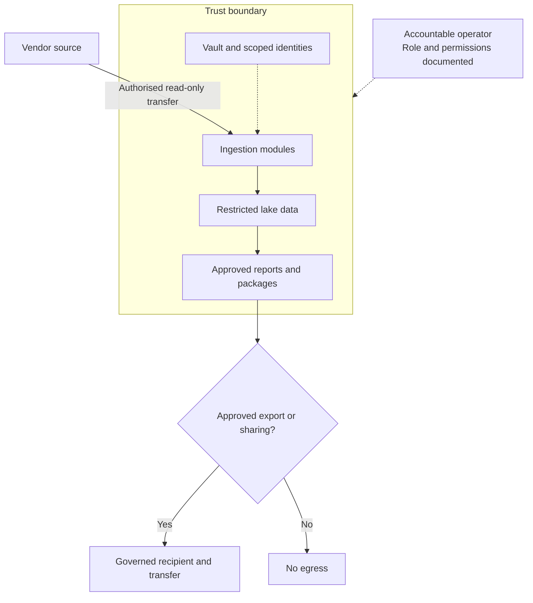

# OEAI Security & Accreditation

> Part of the [OEAI Reference Architecture](README.md). Baseline: **6 September 2026**. See [evidence and references](REFERENCES.md) and [decisions requiring approval](DECISIONS.md).

## 1. Purpose and scope

This document defines the security architecture of an OEAI deployment and the assurance model around it: the trust boundary and data-protection roles; authentication and authorisation from source system to consumption; secrets management; the protections applied to data in the pipeline; the security standards applied to OEAI's own code and repositories; the prerequisites placed on partners — both EdTech vendors providing data in, and Accredited Partners operating deployments; and the cyber security baseline they must evidence.

The posture in one sentence: **pupil data stays in the trust's tenancy, is touched read-only at source, minimally by people, under least privilege, with every secret in a vault and every run logged — and no real data, secrets or private deployment records are committed to a repository.**

## 2. Trust boundary and data-protection roles

*Figure 1 — Trust-controlled processing, least-privilege operation and explicit egress authorisation.*

Determine roles from the actual processing, then record them before access is granted:

* **The trust (school/MAT) is the data controller.** The data is shared with an OEAI deployment on the trust's authority, and the trust can revoke access — at the source system, at the tenancy, or both — at any time.
* **An external operator acting on the trust’s behalf is normally a processor**, with applicable processor terms and sub-processor controls. The trust’s own employees act within the controller, rather than becoming a separate processor. An operator determining its own purposes may have a different role. See [ICO role guidance](REFERENCES.md).
* **The EdTech vendor** remains controller or processor of its own system; provision of data to the trust's deployment happens on the trust's instruction to its vendor.

A data-processing/sharing agreement is in place **before live pupil data flows** — sandbox and synthetic data carry integration work until then. Deployments are supported by a **DPIA support pack** so the trust's DPO can complete their own DPIA efficiently, and a **DPIA addendum pattern** (one row per data source: categories, subjects, lawful basis, retention) extends it each time a module is added — scope expansion is a documented event, not scope creep.

## 3. Authentication and authorisation

### 3.1 The deployment identity

Document the actual execution identity for each pipeline, notebook, source connection and deployment operation. Prefer a supported non-interactive workload identity, with separate deployment/admin and routine data-processing privileges. A Fabric workspace identity is a managed service principal; support depends on the item and connector, so verify the chosen execution path in the target tenant. See [Microsoft workspace identity guidance](REFERENCES.md).

Human operators require named accounts, MFA and appropriate conditional-access controls. A workload identity does not perform an interactive MFA challenge; secure it through scoped permissions, managed credentials/certificates or supported federation, access reviews and revocation. Do not require a universal “service account with MFA” configuration or grant workspace administration by default. Where a connector requires a user-backed connection, record the exception, owner, continuity plan and supported authentication controls.

Human access to a deployment is the exception, not the rule: restricted to the minimum operating team, individually identified (no shared logins), under RBAC and MFA, for defined operational purposes.

### 3.2 Authenticating to source systems

Source-side authentication follows the method taxonomy of the [Integration Architecture](04-integration-architecture.md):

| Method | Standard mechanism |
|---|---|
| REST API | OAuth 2.0 client credentials (preferred); or per-school API key + secret in a header — never in a query string |
| OData | Dedicated service credentials over TLS |
| Warehouse / secure share | Provider-side grant of a read-only role over exactly the shared objects, row-scoped by school where supported |
| SQL database | Dedicated read-only account limited to specific views/schemas, ideally against a replica |
| Files / SFTP | SSH key pair to a chroot-restricted account with per-trust directory isolation |

Universal rules, whatever the method: **read-only always**; **scoped** to the agreed schools, datasets, and fields; a **dedicated service identity** per integration; **TLS 1.2+** for HTTPS/SQL transport or appropriately configured SSH for SFTP; IP allow-listing treated as defence-in-depth only, never the primary control.

The **never-grant list** — access OEAI modules must never hold and vendors should refuse to issue: write/update/delete capability; administrative or account-management scopes; access beyond the agreed schools or datasets; credentials shared with human users; long-lived credentials with no rotation or revocation path.

### 3.3 Secrets management

* **All credentials live in a managed vault** (Azure Key Vault in the `fabric-spark` profile) in the trust's tenancy, resolved **at runtime by name**. Secret *names* appear in configuration; secret *values* appear nowhere else — not in code, not in notebooks, not in config files, not in logs.
* **Per-school isolation**: prefer independently revocable school-scoped credentials. Where a vendor issues trust-wide credentials, document their reach and verify server-side school permissions; separate secret names alone do not create isolation.
* **Rotation without code change**: rotating a credential is a vault operation, not a release.
* **Secure handover**: credentials are exchanged only over encrypted channels or single-use expiring links — never plain email. A vault URL is itself treated as sensitive (it encodes deployment naming).

### 3.4 Authorisation at the consumption end

The trust must govern workspace, notebook, lake/storage, SQL-endpoint, semantic-model, report and export access separately. Row-level security in a report or SQL endpoint does not protect a direct Spark or storage path. Test both authorised and denied users through every route. The architecture's contribution is that everything consumable sits behind the trust's own identity platform — there is no OEAI-side "back door" into Gold. Use the minimum access matrix in §11 and retain target-workspace test evidence; a more detailed reusable profile remains a tracked design item.

## 4. Data protection in the pipeline

* **Residency**: record and approve the actual storage, compute, backup, telemetry, support and sub-processor locations. UK hosting is the reference preference, not evidence that a service has no international access or transfers. Any transfer assessment and safeguards are determined with the controller’s DPO before use.
* **Encryption**: strong encryption at rest (AES-256 class) and appropriate authenticated transport at every hop (TLS 1.2+ for HTTPS/SQL; modern SSH for SFTP).
* **Isolation**: per-trust isolation is structural — the deployment *is* the trust's own tenancy; there is no multi-trust commingling surface in the reference pattern.
* **Classification-driven handling**: everything in Bronze/Silver/Gold is **Restricted** under the [data classification scheme](03-data-architecture.md); the data inventory must identify special-category and other sensitive fields so they can be separately scoped, and are only ingested where lawful and in scope.
* **Minimisation**: modules ingest the agreed entities and fields — not "everything the API returns".
* **AI capabilities**: distinguish locally approved model training from third-party AI services. The F1 ML packages intentionally train local models using authorised data and retain governed artefacts. No external provider training or retention of trust data is allowed without separate explicit authorisation and contractual safeguards. Document processing locations, access, retention, model promotion and DPIA scope for either route.

## 5. Code, repository, and supply-chain security

The code that runs inside trust boundaries is itself a security surface, governed by the standards in the [Module Architecture](02-module-architecture.md):

**The never-commit list** (applies to every OEAI repository, public or private): credentials of any kind (keys, tokens, connection strings, passwords, certificates, `.env` files); customer, trust, or school names — placeholders only; personal data in any form, including notebook outputs, samples, and fixtures (synthetic data only); internal infrastructure details (subscription and tenant identifiers, internal addresses, workspace identifiers); internal URLs.

**Public-grade hygiene everywhere.** The private repository is held to public-release standards even though it is private: private assets may later be released publicly, community access is not internal access, and visibility can change in one click. Consequence: the pre-publication security check at GA is a confirmation, not a cleanup.

**Automated gates on every pull request**: secret scanning, notebook-output checks, and file-policy checks — explicitly a safety net under, not a substitute for, the human review checklist. One learned control worth encoding: notebooks can carry personal data in **widget/display metadata** that ordinary review and output-stripping tools miss — review covers cell sources, outputs, *and* embedded metadata.

**Incident procedure** for a committed secret or personal data: rotate/revoke immediately; personal data additionally goes to the data-protection lead as a potentially reportable breach; purge repository history properly (deletion commits are insufficient); report to repository administrators the same day.

**Vulnerability disclosure**: privately to the code owners — never a public issue containing exploit detail.

**AI policy**: *AI assists, humans decide.* AI may author, migrate, pre-review, and sweep for security issues — and its significant use is declared — but it never approves, never merges, never counts toward review tiers, and is never given material the repository rules themselves ban.

**Release security**: Stage 7 of the module lifecycle includes the mandatory pre-publication check (history reviewed for credentials; no secrets, customer names, internal identifiers, personal data, or internal URLs), and GA sign-off criteria include security and penetration-testing expectations set by the Technical Authority.

## 6. Partner prerequisites — EdTech vendors (data in)

A vendor integrating with OEAI is asked to evidence, via the Data Provision Questionnaire ([Integration Architecture §9](04-integration-architecture.md)):

1. **Access model**: read-only, scoped, per-trust/per-school authorisation; a revocation mechanism the school can operate; support for dedicated service identities (no shared human credentials).
2. **Credential lifecycle**: rotation cadence, revocation path, and secure issuance.
3. **Transport security**: TLS 1.2+; modern authentication (OAuth 2.0 client credentials preferred).
4. **Hosting posture**: hosting region(s), sub-processors, and data-residency position.
5. **Certifications** — these speed everyone's due diligence considerably: Cyber Essentials / Cyber Essentials Plus, ISO 27001, SOC 2, DfE supplier/data-protection assessments, and a DPIA for the product.
6. **Auditability**: vendor-side logging of what was accessed, by whom, when — matching OEAI's per-run ingestion logs from the other side.
7. **Incident path**: a two-way breach and incident notification route agreed before go-live.
8. **A sandbox** with representative, anonymised data, so no integration is developed against live pupil data.

Gaps in identity or data grain block an integration; gaps in certification are weighed proportionately to the sensitivity of the data involved — a vendor sharing special-category safeguarding data is held to the top of this list, not the middle.

## 7. Partner prerequisites — Accredited Partners (deployment operators)

The OEAI deployment model anticipates multiple **Accredited Partners** deploying and operating the architecture for trusts, on a fair, level playing field: uniform prerequisites, proportionate fees, a defined remediation process for partners who fall short, and the same standards for everyone — including any partner affiliated with OEAI's own community, whose interests are handled under declared conflict-of-interest protocols at the Technical Authority.

The following is a **proposed operator-assurance baseline**, to be adopted through the formal accreditation process in [DECISIONS.md](DECISIONS.md). It does not certify or accredit any partner. A trust must still agree and verify the controls applicable to its operator before access:

| Domain | Prerequisite |
|---|---|
| **Cyber certification** | Cyber Essentials as the floor; Cyber Essentials Plus and/or ISO 27001 expected for partners operating at scale or handling special-category-heavy deployments |
| **Regulatory** | Applicable data-protection registration/fee position; appropriate processor terms where the role applies; available sub-processor register |
| **Identity & access** | MFA enforced for all staff; least-privilege RBAC; named individual accounts only; managed endpoints for anyone touching deployments |
| **Data handling** | UK residency commitment; encryption at rest and in transit; per-trust isolation; the OEAI data classification and retention standards ([Data Architecture §§8–9](03-data-architecture.md)) with contract-specific retention/disposal and written verification |
| **Assurance** | Periodic penetration testing of its operating environment; processor notification to affected controllers without undue delay; business-continuity/disaster-recovery summary available to trusts |
| **Trust-facing pack** | DPA, sub-processor register, DPIA support pack, retention & offboarding policy, and standard security questionnaire responses — ready to hand to any trust's DPO |
| **Competence** | Demonstrated capability on the OEAI standards: deployments follow the reference pattern, upgrades follow the controlled-upgrade rules, and module code is consumed as versioned releases, never modified in place |

An adopted accreditation scheme needs named assessors, evidence requirements, review cadence, remediation, suspension and appeal rules. No such award is implied here; until formal adoption, assess the operator through the trust’s procurement and governance process.

## 8. The trust's own responsibilities

Security of a deployment is shared, and the trust-side list is short but real: procure and maintain the tenancy, capacity, and vault; govern workload and human identities in its directory; control who in the trust can reach the workspace, SQL endpoint, and reports; approve upgrade windows; validate business outcomes after canonical upgrades; and fold the deployment into its own DPIA using the support pack.

## 9. The cyber security baseline

The proposed consolidated control baseline below supports deployment due diligence. The accountable owner must adopt, configure and test each control; the table is not evidence of certification or universal enforcement:

| Control area | Baseline |
|---|---|
| Firewalls & network | Restrict inbound administration and data access; allow only required source, identity, vault, platform and approved monitoring egress |
| Secure configuration | Versioned, reviewed infrastructure and code; no default credentials; deployed notebooks never edited in place |
| Access control | Least-privilege RBAC; MFA for human access; protected workload identities; per-school credential isolation; quarterly access review |
| Malware & endpoint | Managed, patched endpoints for all operating staff |
| Patch management | Supported platform versions; timely platform-compatibility upgrades |
| Encryption | AES-256-class at rest; TLS 1.2+ in transit |
| Residency | UK regions; no international transfers in the standard pattern |
| Logging & audit | Per-run, per-school, per-entity ingestion logs; attributable operator actions; log retention per agreed policy |
| Breach response | Processor informs controller without undue delay; controller assesses ICO and individual notification; incident process rehearsed |
| Data lifecycle | Controller-approved retention and disposal periods, recovery-copy coverage and verified deletion |

## 10. Open items

Tracked openly for the Technical Authority's standards agenda: formalising this baseline as a published Accredited Partner accreditation checklist with an assessment process; setting the standard penetration-testing cadence and scope for operators; the consolidated in-deployment RBAC/row-level-security guidance; and fixing the retention parameters flagged as open in the [Data Architecture §9](03-data-architecture.md).

## 11. Minimum access and incident requirements

| Role | Minimum permitted access | Required boundary test |
|---|---|---|
| Deployment administrator | Approved provisioning and release promotion | Routine processing does not depend on unnecessary admin rights |
| Pipeline workload identity | Required inputs, outputs, logging and scoped secret retrieval | Cannot read another trust or unapproved source population |
| Data engineer | Approved validation and operational investigation | Restricted production access is time-bound and auditable |
| Safeguarding practitioner | Authorised safeguarding reports and case-review workflow | Untrained or unrelated staff cannot reach scores, explanations or exports |
| General report consumer | Approved semantic/report surface | Cannot bypass report restrictions through lake, SQL or notebook access |

Treat break-glass access as exceptional, named and logged, with prompt review. Record revocation tests for departures, role changes and partner offboarding. Quarterly access review is a proposed operating baseline; tighten it where risk or agreement requires.

**Breach notification:** a processor must inform the controller without undue delay after becoming aware of a personal data breach. The controller assesses notification to the ICO; where required, notification is without undue delay and within 72 hours of awareness. This is not permission for a processor to wait 72 hours. Agree a faster contractual escalation route and preserve investigation evidence. See [ICO breach guidance](REFERENCES.md).

## 12. Mandatory safeguarding controls

> [!WARNING]
> **Under no circumstances may the Contextual Safeguarding pilot code be used in live operation without explicit ethics approval, expert guidance on configuration, training for every user and strict information governance.** Repository access, passing CI, a data-ethics note or an earlier pilot’s approval does not authorise a new use.

The F1 package is disabled by default. Its code requires current ethics dates and references, expert configuration sign-off, all-user training confirmation, information-governance approval, explicit school scope and a matching configuration fingerprint. Every category has an approved label, feature or exclusion role. Training/scoring reject incompatible feature provenance. Prediction additionally requires an approved pinned model and matching SHA-256 of its bytes before loading.

These checks validate supplied records; they cannot authenticate real approvals, verify training or stop an editor removing code. Enforce them with controlled configuration, protected deployment identities, reviewed changes, access restriction and schedule ownership. Stop operation when approval is withdrawn or scope/training requirements cease to be met; date checks alone do not discover revocation.

Use [package governance](https://github.com/Open-Education-AI/OEAI-Private/blob/main/packages/contextual_safeguarding/GOVERNANCE.md) as the operational contract. No automated adverse action or reduction of support may be based on scores. Staff must understand missing data, false negatives, group errors and the limits of explanations. Include the warning in downstream reports.

Refer to [Matthew Woodruff’s doctoral thesis](https://github.com/Open-Education-AI/OEAI-Private/blob/main/packages/contextual_safeguarding/REFERENCES.md) for research progressed beyond this pilot. The pilot does not implement all subsequent thesis work, and research findings are not a deployment authorisation.
